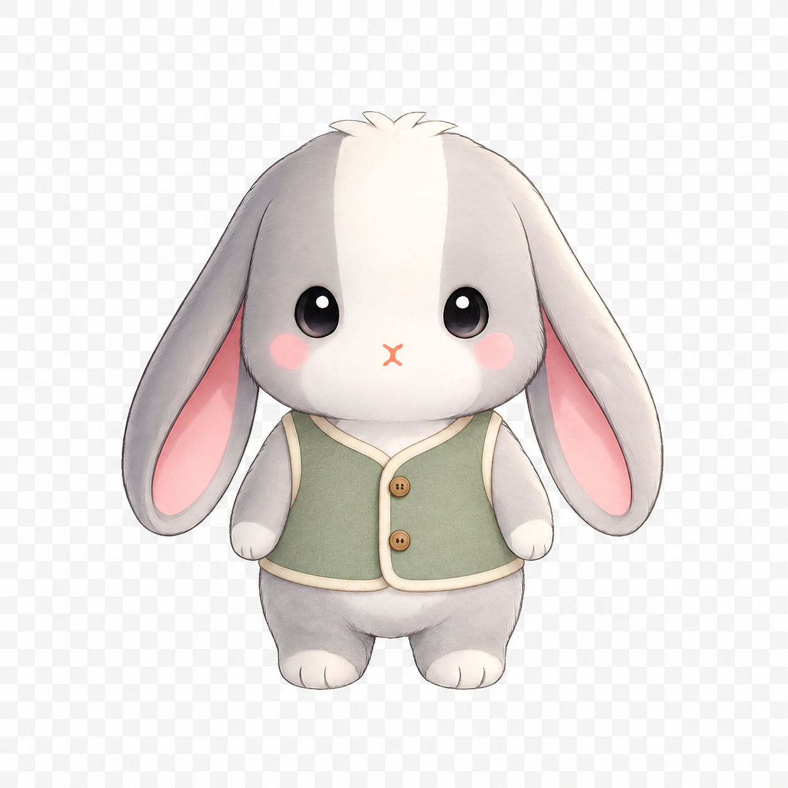
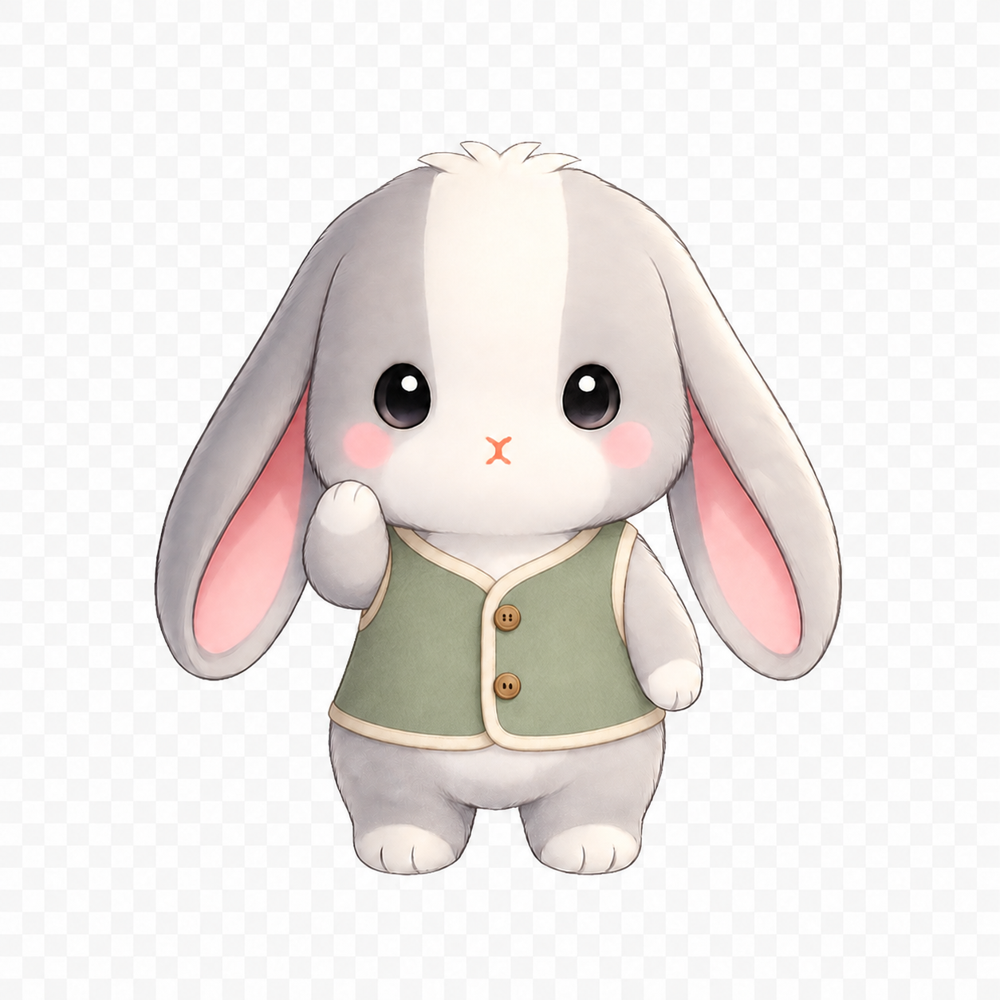

# 兔咪 2D 動作與換裝：第一輪外觀樣品

> **2026-09-08 已停止開發。** 使用者認為動作樣品不自然，選擇維持現有兔咪圖片與原本淡入淡出，轉向介面回饋與轉場。以下為歷史紀錄，不是待精修或待驗收清單。素材保留，不接入正式 App。

2026-09-08。本頁記錄第一輪兩張概念圖。後續已完成[單臂分層與 Flutter 連續動作試驗](rig/README.md)，
原造型與背心共用一段動作；尚未完成全身骨架、Spine 整合或正式 App 接入。
這裡是設計試驗區，不列入 `pubspec.yaml`，不是已核准的正式造型。
使用者後續改以既有核准姿勢作為動作終點；最新[原圖銜接檢查與研究](existing_pose_audit/README.md)
將下一段驗證收斂為中性→邀請，先證明能到達目標，再擴充動作與服裝。

## 結論與優先順序

使用者希望維持 2D 呈現，優先增加日常動作並降低換裝成本。
本輪建議先驗證 **2D 分層／網格骨架＋少量特殊姿勢 CG**，以原圖的毛感、比例和臉部作為外觀標準。
不需要為了使用骨架就改成平塗向量風；但原圖的毛邊、接縫和光影是否能承受變形，必須由動態樣品證明。

先做一個正面角色、一件簡單背心和一段小幅招呼，測試同一動作在原造型與背心之間共用。
通過後再增加耳朵回彈、聆聽時的小幅歪頭、輕輕點頭；坐下、抱物與大角度轉身另做關鍵姿勢。
正背面設定圖仍有價值，但目前不先量產各角度、各表情和各造型的整張圖片。

工具候選先看 Spine：官方有 Flutter runtime 與混合服裝部件的範例。[1][2]
這是針對本專案的候選判斷，不代表已採用、已購買編輯器或已驗證 runtime 效能。

## 現況為什麼難以擴充

- `assets/mascot/core/` 是 12 張情緒圖加 1 張眨眼差分，都是整張 1024×1024 RGBA PNG。
- [造型路徑](../../lib/utils/wardrobe_catalog.dart)透過 `skinnedMascotAsset` 換整組圖片，沒有衣服自動貼合系統。
- [場景](../../lib/widgets/mascot_scene.dart)已有整張圖的呼吸變形與差分切換；尚無可獨立活動的手、耳朵或衣物骨架。
- 本輪在專案檔案中未找到 PSD、Spine、Rive、Live2D、Blender 或 GLB 分層／模型來源。
- 各情緒圖的可見輪廓範圍不同，不能直接把同一件衣服按相同座標覆蓋，就視為全姿勢適配。

繼續生成整張圖的成本會隨「造型數 × 姿勢數」增加。分層骨架的目的，是讓衣服部件沿用既有動作；
新增衣服仍需要設計、拆件、綁定與遮擋檢查，不是上傳任意 AI 圖就能自動穿上。

## 兩張概念圖與驗證結果

| 原地站姿與背心 | 抬手招呼與同款背心 |
|---|---|
|  |  |

先在核准正面底圖的軀幹加背心，再以背心樣品局部改動畫面左側手臂。
背心是檢查肩部、手臂和長耳朵遮擋的測試服裝，未定案為商品或角色常服。
兩張圖顯示可討論的姿勢與外觀，**不能證明動畫連續性或換裝重用已成立**。

| 檔案 | 尺寸與模式 | 判定 |
|---|---|---|
| 正式 `tumi_neutral_front.png` | 1024×1024、RGBA，alpha 0–255 | 本輪未修改 |
| `vest-neutral-concept.png` | 1254×1254、RGB，無 alpha | 概念限定；棋盤格是圖片內容 |
| `vest-wave-concept.png` | 1254×1254、RGB，無 alpha | 概念限定；棋盤格是圖片內容 |

第一張雖要求保留透明背景及原尺寸，實際輸出未符合要求；第二張以它為來源，只測抬手。
本輪沒有進行去背、縮圖或把概念圖當成正式素材。原圖與輸出尺寸不同，未宣稱局部區域外像素完全一致。
正式底圖 SHA-256：`95b81df9721ddf54712a1d8c822e772d8a7e25036ae9ea8b15235d6987aa0f96`。
生成方式與完整提示詞見 [prompts.md](prompts.md)。

## 第一輪提出的技術小樣範圍

後續已完成其中的單臂／無袖背心子集，結果以 [rig/README.md](rig/README.md) 為準；頭、耳、腿尚未獨立活動。

1. 以核准正面圖建立一致畫布、腳底基準、肩部與耳根定位；不把不同整張差分當成已對齊的骨架部件。
2. 準備頭／完整臉部、左右耳、軀幹、左右手臂與腿部；補畫手臂和耳朵移開後露出的身體。
   背心分出必要的前後部件，先驗證「耳朵在身體外側、手在衣服前方」的層次。
   部件清單是試驗起點；是否需要更多分件，由實際接縫與變形決定。
3. 綁定同一段「待機 → 小幅抬手 → 停一下 → 回待機」，原造型和背心共用時間軸。
   不把兩張成品淡入淡出，宣稱為已完成骨架動作。MI 沿用現有音檔，不新增嘴型動畫。
4. 驗收：臉與比例保持辨識、肩部不破洞、毛邊不拉裂、衣服不浮動、手與耳朵遮擋正確，起止能接回待機。
   新背心只新增衣物部件及綁定；如果仍需重做整段動作，表示尚未達到重用目標。
5. 圖層與動畫確認後再接入 Flutter，在正式場景的真實布局驗證；提供模擬器截圖。
   音訊、效能與手感若需要實機結論，由使用者以 profile／release 驗證。

無袖背心比有袖上衣容易起步。有袖衣服要有跟隨手臂的袖子部件；帽子要處理長耳朵前後層；
長外套、裙子、背包可能需要自己的骨頭或約束。Spine 官方換裝範例也需要額外部件與骨頭，[2]
所以不能把「共用動作」承諾成「所有服裝零調整」。

## 2D 與 3D 怎麼選

| 方法 | 能重用什麼 | 本輪判斷 |
|---|---|---|
| 2D 分層／網格骨架 | 原畫部件、動作時間軸、服裝附件綁定 | 優先小樣；符合目前正面陪伴與小動作需求 |
| 3D 模型＋繪製貼圖，再輸出 2D | 模型骨架、角度、動畫；仍需服裝形狀與權重 | 若連續轉身、多視角成為主要需求，再比較是否值得重建兔咪外觀 |
| 把 2D 圖片放進 3D 空間 | 圖片位置與有限的視差 | 無法自動產生身體背面、補出被遮住的部位，不能單獨解決換裝 |

2D 外觀與製作工具可以分開決定。3D 可以做出偏 2D 的畫面，但不是免除衣物適配的捷徑；
而 2D 骨架也無法憑一張正面原圖自然完成任意轉身。這是本專案的製作路線評估，尚無兩種完整管線的實測比較。

## 參考與本輪範圍

2026-09-08 查閱官方資料：

1. [Spine Flutter runtime](https://esotericsoftware.com/spine-flutter)：官方整合與 skins 範例；選用時需核對 editor／runtime 版本和授權條件。
2. [Spine Mix and Match](https://esotericsoftware.com/spine-examples-mix-and-match)：分件、服裝附件與可依造型啟用的骨頭／約束。
3. [Live2D 素材拆分](https://docs.live2d.com/en/cubism-editor-manual/divide-the-material/)：成品插畫需要分出可動部件。

第一輪只有圖片與文件，驗證為圖片尺寸／alpha、原圖未變與文件連結檢查。
後續可播放試驗台的結果見 [rig/README.md](rig/README.md)；兩輪皆未替換正式角色或宣稱實機效能驗證完成。
