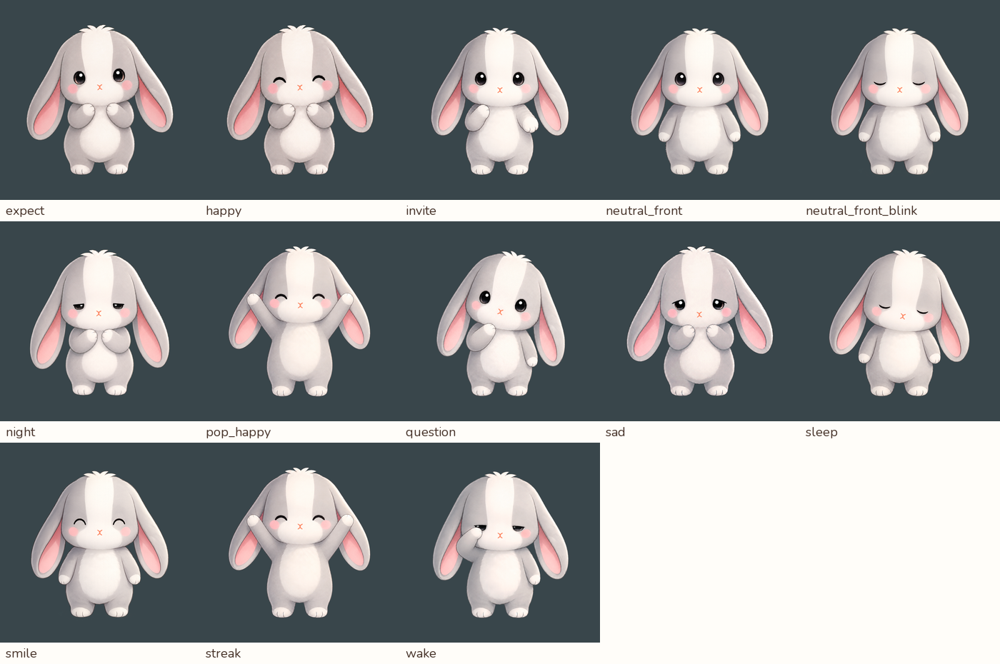
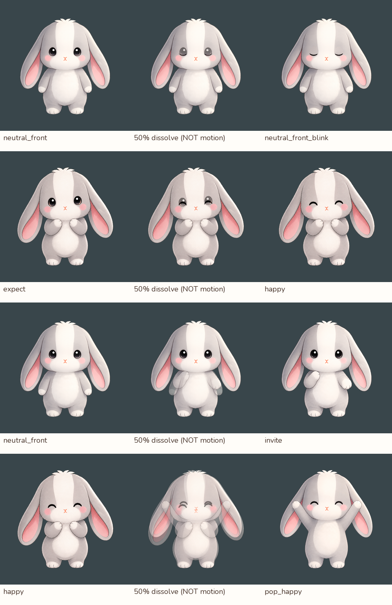

# 現有核准姿勢：銜接檢查與製作路線

2026-09-08。使用者提出先以現有核准圖當作動作終點，再判斷如何自然銜接。
本輪完成 13 張 core PNG 盤點、4 組切換／淡化對照與官方資料研究；沒有製作新的連續中間姿勢，沒有接入正式 App。
先前單臂試驗只證明局部網格能動，沒有證明能準確到達這些核准姿勢。
後續進度：[中性→邀請第一段可播放美術樣品](../invite_transition/README.md)已完成，接合與自然度仍待審查。
本頁保留當時的原圖診斷結果，四份淡化 GIF 並非後續動作樣品。

## 判斷

**優先採用核准姿勢驅動的 2D 混合方式：小幅變形、局部姿勢替換，以及必要時補畫中間姿勢。**
這是待樣品驗證的製作建議，不是已證實全身動作與任意換裝都可行。

現有成品 PNG 可以定義「最後應該長什麼樣」，但沒有提供被手遮住的身體、手臂轉向後的輪廓或中間運動路徑。
如果直接淡化失敗，只能排除把淡化當作肢體運動的方法；如果分層後仍無法到達目標，則應檢查分件、遮擋與缺圖。
只有代表性動作在合理補圖與修改後仍無法達到外觀要求，才有足夠理由淘汰該製作管線。

## 原圖觀察

| 代表組合 | 實際觀察 | 適合驗證的內容 |
| --- | --- | --- |
| 中性 → 閉眼 | 主要輪廓一致，眼睛改變；慢淡化仍會出現重疊眼睛 | 局部表情替換、眨眼節奏 |
| 期待 → 開心 | 雙手同在胸前，但臉與細部並非完全相同 | 同一身體姿勢內的表情演出 |
| 中性 → 邀請 | 一隻手從身側到胸前，另一手也有差異 | 第一個必須到達核准終點的抬手樣品 |
| 開心 → 雀躍 | 雙手高舉，頭、耳、軀幹與遮擋都改變 | 複合姿勢；需要更多局部圖或過渡姿勢 |

中間欄只是兩張圖各半的混合，不是補間動畫。中性→邀請可見雙重手臂；開心→雀躍可見手、頭與耳朵重影。
因此不把「調慢／調快淡化」當作目前手勢問題的解法。

可播放對照：左側直接換姿勢，右側 360 ms 淡化。兩者皆沒有新畫中間姿勢，也不是最終演出品質。

- [中性 → 閉眼](neutral_front-to-neutral_front_blink.gif)
- [期待 → 開心](expect-to-happy.gif)
- [中性 → 邀請](neutral_front-to-invite.gif)
- [開心 → 雀躍](happy-to-pop_happy.gif)

### 對齊與測量限制

所有來源維持原本 1024×1024 畫布，沒有逐張調位或縮放來掩蓋差異。
中性／閉眼在 alpha ≥ 128 時的邊界都是 `(157, 145, 863, 895)`。
先前口頭提到的 40 px 高度差來自極淡透明殘留，**不是角色主體高度差**，本輪已更正。

完整數據見 [measurements.json](measurements.json)。alpha ≥ 64 的輪廓交集／聯集比，中性→閉眼為 0.9978，
期待→開心為 0.9915，中性→邀請為 0.9716，開心→雀躍為 0.8979。
這些值只協助檢查輪廓差異，不是自然度分數、定位點誤差或骨架相容性的證明。
下半部 RGB 差異也不能推論整張圖完全一致。

## 如何製作與呈現

1. **先固定既有起止圖。** 第一個實質樣品選中性→邀請，以核准邀請圖的手位置、比例與遮擋為驗收標準。
   不用手臂可轉幾度或網格不破洞代替動作達標。
2. **只拆這一段需要的部件。** 比較手臂在身側與胸前的輪廓；補齊動作會露出的身體，安排手臂前後層次。
   小範圍沿路徑變形，輪廓超過可承受範圍時換成目標局部圖；若切換仍可見跳動，再補必要的中間姿勢。
3. **先把手的路徑做好，再加性格。** 小幅預備、視線、耳朵延遲與停頓服務動作，不用整隻晃動或特效遮住接縫。
   完成後才配既有 MI 語音與意思字幕，兔咪不新增人類嘴型。
4. **只連接劇情需要的姿勢。** 可先以中性作共同起止點，另設期待→開心、熟睡→剛醒等合理路徑。
   不要求 13 張圖彼此任意直連；這些路徑是製作提案，尚未加入正式事件狀態。
5. **再測同一段換裝。** 表情與衣物盡可能分開；身側手、胸前手、高舉手是不同服裝／遮擋檢查情境。
   背心可能重用軀幹部件；長袖需要對應手臂姿勢，不能承諾一張衣服貼圖自然覆蓋全部動作。

AVG 對話可使用有意識的姿勢切換、停頓和少量局部動態；需要讓使用者看清楚「抬手過程」的互動，
仍應製作真正的動作銜接。兩類演出可共存，無須每句字幕都播放大動作。
如果之後連續轉身與多視角成為主要需求，再比較 3D 製作、輸出 2D 的成本；本輪不切換技術。

## 官方資料與研究

查閱日期 2026-09-08。以下證實工具能力／方法，對兔咪的適用性仍是本專案的推論。

- [Spine：Animating](https://us.esotericsoftware.com/spine-animating)：先建立主要姿勢，再調時間與中間動作，支持先定終點的工作順序。
- [Pose2Pose，IUI 2020](https://gfx.cs.princeton.edu/gfx/pubs/Willett_2020_PPS/pose2pose.pdf)：描述剪紙式角色結合連續變形與離散圖稿替換；較大的手勢差異會超出單純變形的適用範圍。這直接對應目前手能動、卻到不了想要姿勢的問題。
- [Adobe：Triggers 與手勢替換](https://www.adobe.com/us/learn/adobe-character-animator/web/use-triggers-to-control-animation-behaviors)：以互斥 swap set 切換不同手圖。局部替換本身是可用的製作方法；切換時機仍需設計。
- [Live2D：素材拆分](https://docs.live2d.com/en/cubism-editor-manual/divide-the-material/)：分件後補足遮住的區域；支持保留原圖、在副本上拆分和補畫。
- [Spine：影格序列](https://esotericsoftware.com/blog/Spine-4-1-released#Frame-by-frame-animation)：圖像序列可以和附件、骨骼動作組合，並非只能選全部逐格或全部骨架。這是 4.1 發布文章中的功能說明，不代表目前最新版本為 4.1。
- [Ren’Py：Layered Images](https://www.renpy.org/doc/html/layeredimage.html) 與 [Transitions](https://www.renpy.org/doc/html/transitions.html)：表情、服裝、手臂可分組組合；Dissolve 是圖像混合，沒有替角色建立新的肢體姿勢。本專案仍用 Flutter，沒有導入 Ren’Py。

### AI 能幫到哪裡

- [ToonCrafter，SIGGRAPH Asia 2024](https://ttwong12.github.io/papers/tooncrafter/tooncrafter.html)：以端點圖生成中間動畫；作者也展示語意理解、物件出現／消失方面的失敗案例。可當過渡候選，不能只看流暢就假設兔咪輪廓、透明背景與衣物都正確。
- [ToonComposer，2025](https://arxiv.org/abs/2508.10881)：使用彩色參考和稀疏關鍵姿勢草圖控制生成。對本題的啟發是補上動作路徑的設計資訊，而不是完全讓 AI 猜兩張成品之間該發生什麼。
- [Bunraku，2026-07 預印本](https://arxiv.org/abs/2607.27348)：研究從單張插畫生成有順序的 RGBA 圖層、網格與姿勢參數，也報告衣物重新貼圖後重用網格。這值得後續評估，但尚未在兔咪毛邊、體型或 Flutter 管線上實測，不能當成現成可用的換裝保證。

本輪沒有執行以上 AI 模型、沒有將素材上傳至這些研究服務，也沒有宣稱已取得它們產生的兔咪動畫。
目前可直接完成的是原圖檢查、副本分層與合成、受控動作原型和驗證；AI 補畫另依既有素材技能處理。

## 重現與驗證

執行 `python3 design_trials/tumi_2d_motion/existing_pose_audit/audit.py`，需 Pillow、NumPy 與專案既有 Nunito 字型。
來源為 `assets/mascot/core/*.png`；本輪 13 張檔案執行前後 SHA-256 一致。
腳本只輸出本資料夾，核准圖不覆寫，產物不列入 `pubspec.yaml`。

- Python 3／Pillow 的離線診斷；非模擬器或正式 parent layout 驗證，沒有正式 UI 文案、事件或裝置手感結論。
- 原圖總覽 1400×930；中間值對照 960×1480；GIF 520×350、每輪 2760 ms。
- GIF 共用調色盤減少閃動，但受 256 色量化限制；細部判斷以 PNG 和原圖為準。
- 已檢查四份 GIF 尺寸與總時長、原圖 hash，並目視 PNG 對照。這些檢查不證明連續抬手已完成。
- 本輪未修改 Flutter 程式，沒有重跑 Flutter analyze／test；先前試驗的測試結果不延伸為本輪尚未製作動作的驗證。
