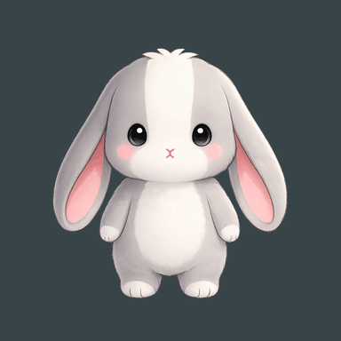
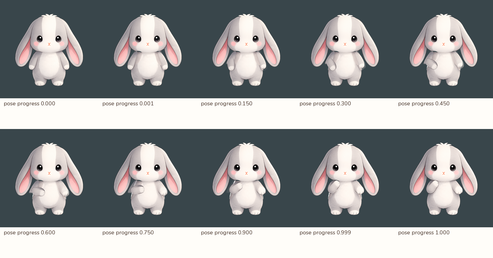

# 核准中性→邀請：第一段可播放美術樣品

> **2026-09-08 已停止開發。** 使用者認為動作樣品不自然，選擇維持現有兔咪圖片與原本淡入淡出，轉向介面回饋與轉場。以下為歷史紀錄，不是待精修或待驗收清單。素材保留，不接入正式 App。

2026-09-08。完成一段依既有核准姿勢建立的抬手／返回樣品，以及獨立 Flutter 預覽。
這一輪驗證「目標姿勢能指導動作路徑」，仍需審查前臂接合、肩部陰影與整體自然度，**不是正式動畫定稿**。
正式 App 沒有引用此入口，未新增換裝、語音、獎勵或背景事件。



## 實際做法

- 起點與停留終點使用核准的 `neutral_front`、`invite`；目標手掌位置由邀請圖決定。
- 從副本分出上臂、前臂與另一隻手，前臂繞肘部抬起。兩張前臂圖先在局部座標對齊輪廓，再混合圖面，減少直接淡化的雙重手形。
- 被遮住的軀幹使用一次 AI 局部補圖，只採用手臂附近遮罩；臉、耳朵和腳沿用核准來源。
- 另一隻手也從既有中性手勢銜接至邀請手勢，身體細部在兩個核准版本間過渡。
- 一條 4.2 秒時間軸：起點停留 600 ms、抬手 1200 ms、邀請停留 600 ms、返回 1200 ms、起點停留 600 ms。

此樣品是局部分層、輪廓對齊與圖面混合的美術試驗，尚未成為可重用的全身骨架。
目前頭部沒有另加擺動、耳朵跟隨或 MI，以便先看清楚手臂問題。

## 這輪處理的根因

第一版使用矩形身體修補範圍，碰到無關耳朵，產生方形缺角。
改為沿實際手臂輪廓的修補遮罩後，無關耳朵保留；沒有用移位補償。

兩張前臂圖只做旋轉／縮放對齊時，寬度與縮短透視不同，中途仍有雙重輪廓。
現在先按局部截面將兩邊輪廓映射到共同形狀再混合。這解決的是輪廓對齊；
前臂根部圖稿與上臂的接合仍有美術限制，不能因此宣稱所有姿勢皆能自然轉換。



## 操作與驗證範圍

預覽提供播放一次、暫停、時間滑桿、回到起點、核准邀請姿勢、放大與降低動態效果。
背景／不可見時停播，回前景不自動續播；降低動態保留靜態邀請姿勢並停用播放／跳點操作。

模擬器：iPhone 17 Pro／iOS 26.5，debug、402×874 pt、上下 inset 62／34、繁中開發文案、預設字級。
沿用正式 `sceneRegionHeightAnchored` 與 `mascotStageScale`、252 pt stage、左右各 8 pt 留白，
PNG 顯示約 213.0 pt。放大為接縫檢查，不是正式尺寸。深底是檢查背景，不是正式房間、光照或對話 UI。

- [正式尺寸：中性](review/simulator-neutral.png)
- [正式尺寸：邀請](review/simulator-invite.png)

素材檢查見 [checks.json](checks.json)：13 張核准來源 SHA-256 不變；兩個身體修補遮罩外變動數皆為 0。
起止停留直接顯示核准圖；另檢查進度 0.001／0.999，避免只測原圖停留就宣稱無接縫。
其全畫布平均色差約 0.32／0.28（0–255 色階），**平均值不能代替接合處的目視審查，也不是自然度合格分數**。

檢查：`flutter analyze --no-pub` 無問題；完整 `flutter test --no-pub` 853 項通過，
最後的預覽按鈕修正另重跑分析與 23 項相關／兔咪測試。
測試覆蓋預覽尺寸、播放推進、背景停止與降低動態效果，不是實機 FPS／耗電證明。

## 和 30／60／120 FPS 的關係

本輪為了直接審查圖面，離線輸出 31 個姿勢，放進一張 384 px tile 的 atlas，由 Flutter 時鐘依時間選取。
GIF 以 25 FPS 取樣，是傳閱格式；**31 個姿勢或 GIF 的 25 FPS 都不是 App 全域幀率設定**。
這個 atlas 沒有驗證正式高更新率動作、長袖換裝或效能，不應直接量產為完整造型庫。
待圖面銜接通過後，再決定哪些部件保留即時變形、哪些使用姿勢替換。

上架建議見[幀率策略](../../../docs/frame_rate_strategy.md)：預設自動，60 FPS 作主要互動品質目標，高更新率另以實機驗證。

## 重現

```sh
# 可選：需 Pillow、NumPy；核准原圖不覆寫。
python3 design_trials/tumi_2d_motion/invite_transition/prepare.py

# 終端 1：僅服務本機模擬器。
python3 -m http.server 8767 --bind 127.0.0.1 --directory design_trials/tumi_2d_motion/invite_transition

# 終端 2：只使用 iOS 模擬器 ID，不選實體裝置。
flutter run --debug --flavor dev -d <simulator-uuid> -t design_trials/tumi_2d_motion/invite_transition/main.dart
```

生成圖層存於本資料夾 `layers/` 並由腳本重建，不加入 Git 或 production `pubspec.yaml`。
AI 原始輸出與[提示詞](prompts.md)已保留，atlas、GIF、檢查接觸表及預覽入口可直接使用。
