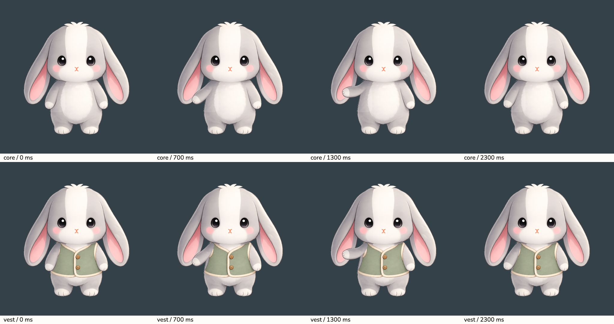
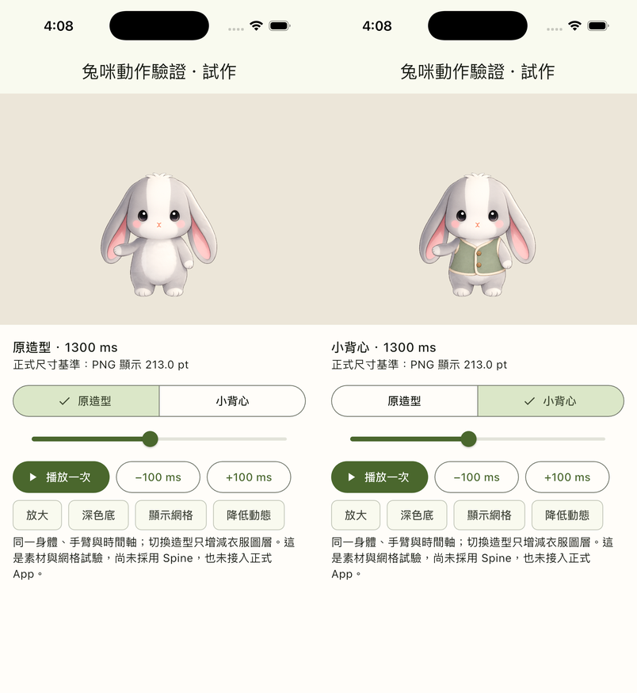

# 單臂 2D 網格與背心共用動作驗證

2026-09-08。**已完成可播放的 Flutter 獨立試驗台；共用方式通過，精緻演出仍未完成。**
正式 `lib/main.dart` 沒有引用此入口，沒有換掉正式角色或導入 Spine。



[iOS 模擬器播放錄影（放大檢查）](review/motion-simulator.mp4)



## 這次實際做到什麼

- 原造型與背心使用同一張身體、同一隻手臂、同一份網格與同一條 2.8 秒時間軸。
  背心模式只增加 `vest.png` 圖層，切換不重設播放進度。
- 肩部保持連接，手臂沿自身方向彎曲、抬起、停留、回到原位，手畫在長耳朵與衣服前面。
  本輪只動一隻手，不包含耳朵動畫、轉身、手掌翻面、表情／MI 事件。
- 可以播放一次、暫停、拖時間軸、每次前後 100 ms、換裝、放大、換深色底及顯示網格。
  背景時停止，回前景需手動續播；降低動態時保留靜態抬手姿勢，不自動播放。

本輪是 Flutter `Canvas.drawVertices` 的單臂曲線網格試驗，**不是已完成的 Spine 骨架或完整通用換裝系統**。
它驗證了分層圖與一段動作的重用方式，不能推論袖子、帽子、裙子、背包或其他角度皆可直接使用。

## 素材處理與限制

使用者已明確同意程式處理副本的裁切、去背、對齊；核准原圖保持不動。
[prepare.py](prepare.py) 可重跑：

1. 從核准正面圖裁出一隻手臂，以真實 alpha 保存毛邊。
2. AI 局部移除手臂並補出身體；只採用手臂附近的修補區域，其餘回用核准原圖。
3. AI 補出背心被手臂遮住的部分；以衣物輪廓和顏色建立遮罩，去除畫入的棋盤格。
4. 輸出同一個 1024×1024 座標系的 `body.png`、`arm.png`、`vest.png`，全部 RGBA。

衣物顏色遮罩只適用這件鼠尾草綠／象牙色背心，**不是泛用去背器**。
新造型仍需要合適的服裝圖層、遮擋和局部補畫。有袖上衣還需要跟著手臂變形的袖子素材。
來源 PNG 與完整提示詞見 [prompts.md](prompts.md)。驗證數值見 [asset-check.json](asset-check.json)：
補圖遮罩外的身體像素變動數為 0；正式底圖 SHA-256 與本輪開始前一致。

## 驗證結果與判斷

| 項目 | 結果 |
|---|---|
| 同段動作換裝 | 通過；兩套直接共用 `motion.dart`、身體與手臂，沒有第二條動作時間軸 |
| 透明圖層 | 通過；三張皆有 0–255 alpha；不把棋盤格當透明 |
| 網格與肩部 | 全程每 10 ms 檢查，三角形不翻面，肩部錨定區不位移 |
| 收尾 | Flutter 實際畫出的第一幀與最後一幀逐像素相同，兩種造型皆通過 |
| 身份一致 | 換裝前後臉部區域的實際輸出逐像素相同；沒有換用 AI 重畫的臉 |
| 操作／背景 | 換裝保持當前時間；背景停止；降低動態保留靜態姿勢 |
| 動作美術 | 仍需精修；目前偏柔軟彎曲，尚無手掌轉向、耳朵跟隨和身體配合，不能視為最終招呼演出 |

第一版沿畫布 Y 混合旋轉，斜向手臂被拉成細帶，且 670 ms 開始出現翻面。
根因是變形方向沒有對準手臂。改為沿手臂中心線彎曲、保持截面寬度後，相同範圍的網格檢查通過；
沒有縮小動作幅度或增加位移補償掩蓋問題。

模擬器：iPhone 17 Pro、iOS 26.5、debug、402×874 pt、上下 inset 62／34、預設字級、繁中開發介面。
場景尺寸沿用 production `sceneRegionHeightAnchored`／`mascotStageScale`、252 pt stage、左右 8 pt 留白及底部對齊；
此機型的 PNG 顯示約 213.0 pt。預覽修正為從 Scaffold 外讀取 top inset，避免 body 的零 padding 放寬限制。
放大模式為刻意的接縫檢查，不代表正式尺寸。此獨立台沒有房間背景、環境光與完整對話 UI，
因此未宣稱已完成正式場景整合或實機音訊／效能驗證。

檢查完成：`flutter analyze --no-pub` 無問題；完整 `flutter test --no-pub` 852 項通過，
包含 `mascot_test.dart` 及本輪 4 項動作／畫面／生命週期檢查。

## 重現

從專案根目錄執行；素材已保存，不重跑生成也可使用。

```sh
# 可選：在有 Pillow、NumPy 的 Python 環境重建透明圖層。
python3 design_trials/tumi_2d_motion/rig/prepare.py

# 終端 1：僅向本機提供本試驗的三張圖。
python3 -m http.server 8766 --bind 127.0.0.1 --directory design_trials/tumi_2d_motion/rig/layers

# 終端 2：將 <simulator-uuid> 換成 iOS 模擬器 ID，不能選實體裝置。
flutter run --debug --flavor dev -d <simulator-uuid> -t design_trials/tumi_2d_motion/rig/main.dart

# 測試與實際 Flutter 繪圖接觸表（輸出 tmp/tumi-rig-contact.png）。
TUMI_RIG_CONTACT=1 flutter test test/tumi_rig_trial_test.dart test/mascot_test.dart
```

PNG 不加入 production `pubspec.yaml`；獨立入口只在 debug 執行，啟動時從本機讀取圖層，載入後不持續連線。
回到正式 App 請重新以 `lib/main.dart` 啟動。試驗台不初始化或改寫習慣、帳號與衣櫃資料。

## 下一個值得投入的關卡

可以繼續採 2D 分層方向，但先完善肩部／手掌素材和一段招呼的表演品質，再擴充動作。
若要採 Spine，接下來仍需真正的編輯器骨架、網格／權重、skin 附件和 Flutter runtime 樣品，
本試驗不能替代這些驗證，也不應直接擴成自製全身動畫引擎。
