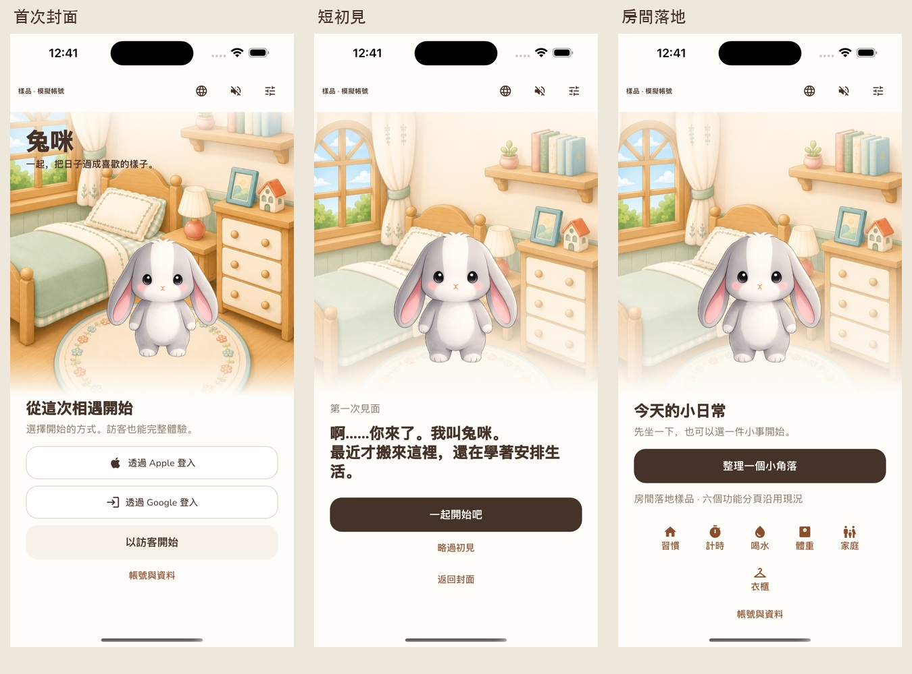

# 入口互動樣品 · 本輪交付

本輪遵循 2026-09-12 使用者的製作指示。《兔咪 Entry Experience：產品與架構提案》（`codex/entry-experience-proposal`／`cb8740b`）保留為參考，**不代表整份產品決策已核准**。本文件只記錄這一段樣品與驗證。



## 版本與隔離

- 開工原工作區：`codex/tumi-roommate-direction`／`0737a7d`，與遠端同步；僅有既存未追蹤 design_trials 素材，未動它們。
- redesign：`codex/experience-redesign`／`a579d10`；含未提交 cover_v1～v3 候選，未合併或搬入。
- 本輪：fetch 後 `origin/main`／`2689934` → `codex/entry-cover-preview`，獨立 worktree `/private/tmp/tumi-entry-cover-preview`。
- 與報告的差異：回訪冷啟動保留封面；新旅程三種入口平列；有憑證、無本機資料走恢復；只做記憶體 preview，未搬帳號與備份系統。
- 入口 `lib/dev/entry_preview_main.dart` 限 debug，正式 `main.dart` 沒有 import 或 route 接入。旅程、帳號、語言、大字、降低動態均僅存在本次程序記憶體。既有音訊服務使用 mock preferences，啟動時不讀取正式偏好值。
- 未改 bundle ID、原生 LaunchScreen、供應商設定、生日功能或正式 onboarding；未操作既有裝置的 app/container 與正式資料。原生測試限本輪新建的兩台模擬器。

## 素材與呈現

目前使用 main 已有的 `home_day.webp` 和 `tumi_neutral_front.png` 原圖組合，未重繪、修臉或變更身形。這是**待封面素材確認的暫用構圖**，不是新核准封面。

已詢問使用者：核准封面是否為尚未提交的 `key_art_living_room_v3_smaller_door_stone_entry.png`；未獲明確確認前不採用該候選。既有 redesign 的 `entry_home_v1.png` 沒有兔咪，也未把它當成可以移除角色的依據。

第一個 Flutter 初始化畫面使用與 native LaunchImage@3x.png 相同的位元組與 cover 裁切；解碼完成即可進入封面，不加最低等待時間，不顯示假下載百分比。真正圖片載入失敗及預覽初始化失敗皆可重試。

封面→室內使用 360ms 淡入淡出，室內短初見→暱稱→房間使用 240ms 文字區切換；沿用 AppPressMotion 0.975／90ms／160ms 與既有音訊服務。降低動態時取消縮放、轉場與面板滑動，保留顏色及文字狀態。聲音預設關閉，可由封面喇叭開啟。場景轉場維持完整可用高度，首次／回訪不因面板長度重新置中；工具列與訊息區保留獨立高度；大字的品牌文案改為正常排版，不壓住角色；初見／暱稱換成房間時重設室內捲動位置。

## 畫面與操作對照

右上調整圖示打開「預覽情境」，各情境重新建立**樣品狀態**。

| 情境／操作 | 應出現的畫面與行為 |
|---|---|
| 首次使用 | 封面同頁顯示 Apple、Google、訪客；不自動建立訪客 |
| 點 Apple／Google | 明確標示「登入情境模擬」的結果面板；成功新旅程、成功恢復、取消、失敗、網路失敗可選 |
| 以訪客開始 | 短初見；可繼續到可省略的暱稱，或直接略過初見進房間 |
| 回訪・已登入／訪客 | 封面顯示「繼續一起生活」，點擊直接進房間；保留帳號與資料說明入口 |
| 有憑證・無本機旅程 | 「找回原來的日常」→模擬恢復；失敗仍是未確認資料，成功直接進房間 |
| 取消／失敗 | 回封面，顯示原因，不建立旅程；可再點登入或選訪客 |
| 首次・離線 | Apple／Google 顯示離線說明；仍可明確選訪客進入 |
| 初始化失敗 | 顯示可操作「重試」，重試後回封面 |
| 模擬重新啟動 | 保留本次記憶體旅程、回封面；點繼續接續，不重播已完成初見 |
| 真正程序重新啟動 | 從指定 fixture 重新建立，回封面。要模擬已有旅程的冷啟動，使用 `ENTRY_SCENARIO`；沒有做持久化保存 |
| 語言 | 封面地球圖示：跟隨系統／繁中／English；日文無可選項 |
| 大字／降低動態 | 情境面板的 200%／降低動態覆寫；也繼承系統 MediaQuery |
| 房間 | 「整理一個小角落」只切換樣品完成狀態；六分頁取既有 tab catalog，點擊顯示範圍說明，不連到正式資料 |

生日沒有入口欄位，原生日資料、設定與功能未動。暱稱選擇不影響能否進入房間。

本機交付頁：`~/.codex/visualizations/2026/09/12/01a09392-a6db-7e03-b2f0-5f7f02bbc75a/entry-cover-preview/index.html`。含原始 PNG、可切換對照、三段影片與驗證 log。

## 如何啟動

只在 Mac 的 iOS 模擬器執行；`-d` 必須是 simulator UUID。

```sh
flutter pub get
flutter run --debug --flavor dev -t lib/dev/entry_preview_main.dart -d <SIMULATOR_UUID>
# 已有訪客旅程的程序冷啟動
flutter run --debug --flavor dev -t lib/dev/entry_preview_main.dart \
  --dart-define=ENTRY_SCENARIO=returningGuest -d <SIMULATOR_UUID>
```

fixture 名稱：`firstUse`、`returningSignedIn`、`returningGuest`、`credentialsOnly`、`offline`、`initializationFailed`。

原生自動操作與擷取：

```sh
python3 scripts/review/run_entry_preview.py --device <BOOTED_SIMULATOR_UUID> \
  --output design_trials/entry_cover_preview/review_v7/<size>
```

測試逐步操作實際 Flutter 樣品，host 透過 simctl 擷取完整裝置畫面、錄製 H.264，並回報完成後才換頁；測試等待只用於觀察／擷取，未寫進 app 的初始化時間。

## 本輪修改範圍

| 檔案 | 範圍 |
|---|---|
| `lib/dev/entry_preview_main.dart` | debug 入口、隔離音訊偏好、native 首幀橋接 |
| `lib/dev/entry_preview/{app,page,model}.dart` | 呈現、暫存狀態、情境、語言、可及性覆寫 |
| `lib/l10n/app_{zh,en}.arb` | 本輪實際 zh/en 文案 |
| `lib/utils/app_style.dart` | 精確沿用 roommate 已存在的 AppPressMotion 定義，未改其他 token |
| `assets/scenes/onboarding/entry_preview_launch.png` | native launch 原圖位元組副本 |
| `assets/story/.gitkeep` | 保留 main pubspec 已宣告但空缺的資產目錄 |
| `test/entry_preview_test.dart` | 狀態、異步過期回呼、隔離、尺寸／字體／語言、lifecycle 測試 |
| `integration_test/entry_cover_review_test.dart`、`scripts/review/` | 真實模擬器操作、截圖與錄影、比較頁及影片解碼工具 |
| `pubspec.yaml`、`pubspec.lock`、`ios/Podfile.lock` | SDK integration_test 與其測試相依，未加入 OAuth SDK |
| `docs/tumi_dialogue_catalog.md` | 先記錄僅 preview 的初見／房間事件 |
| `docs/entry_cover_preview.md`、`docs/delivery_plan.md`、預覽圖／證據 manifest | 本輪交付與待驗收項目 |
| `.gitignore` | 本機原生錄影與過程擷取不納入版本庫；原檔另外保存在交付資料夾 |

## 執行證據與界線

最終影像目錄為 `design_trials/entry_cover_preview/review_v7/`。review_v1～v6 的過程擷取不列為最終畫面證據。

### 已執行的檢查

| 檢查 | 實際環境／結果 |
|---|---|
| `flutter analyze --no-pub` | 無問題 |
| 完整 `flutter test --no-pub` | 最終原始碼 852 項通過 |
| 入口 widget／model | 15 項通過；375×667、430×932，繁中／英文，1×／2×字級，降低動態；檢查文字不壓角色、工具列不遮內容、錯誤可見、房間捲動重設、回訪構圖固定及偏好資料 sentinel 不變 |
| 兔咪必要測試 | 已執行 `test/mascot_test.dart`，亦納入最後完整套件 |
| 原生自動操作 | iOS 26.5、debug dev；iPhone SE 3 與 iPhone 14 Pro Max 各一組最終流程通過；每台 22 張 PNG，共 44 張，無連續重複擷取 |
| 真正程序冷啟動 | SE 3 獨立 debug target，`returningGuest` fixture；錄影與額外截圖確認初始化後停在「繼續一起生活」封面 |
| 影片 | 兩段操作＋一段冷啟動，H.264；使用 AVFoundation 實際解碼抽格驗證，無音軌 |
| 工具／文件 | Python AST、ARB JSON、diff 空白檢查；比較頁的本機檔案與 JS 語法檢查 |

先前曾發生擷取與換頁競速、大字疊層與短場景置中，已修正並重拍。另一次並行建置／回歸曾遇到 `AssetManifest.bin` 暫缺；後來分開執行完整套件，852 項通過。這些過程畫面不混入最終對照。

### 僅模擬與尚未驗證

- **僅模擬**：Apple／Google 結果、登入憑證、本機旅程、恢復、離線及初始化失敗 fixture；不代表真實登入、網路中斷或備份完成。
- **背景／前景原生操作未測**：電腦操作工具回報 Mac 已鎖住，要求手動解鎖。widget 已觸發 inactive／paused／resumed 並保留房間，但不能代替實際按 Home 再回 APP 的驗證。
- 大字與 Reduce Motion 的原生畫面使用樣品覆寫；本輪是亮色、直向。未手動切換 OS 設定，未做 VoiceOver、深色／橫向、原生暱稱鍵盤操作或實機驗證。
- 音訊重用既有服務，但本輪未聆聽驗證；錄影無音軌。實機音訊、觸覺、順暢度及 release 啟動效能由使用者另驗，不以 debug 模擬器代替。
- **封面素材仍待確認**。請先判斷：原圖選擇、兔咪位置、三種入口層級、按壓與封面到房間的節奏。樣品已停在本輪範圍。

正式接入前仍必須補齊：核准封面、使用者對構圖／按壓／銜接的驗收、真實儲存讀寫及恢復／中斷策略、真實 OAuth 與備份狀態、正式錯誤處理與實機驗證。本輪不執行這些正式接入項目。
