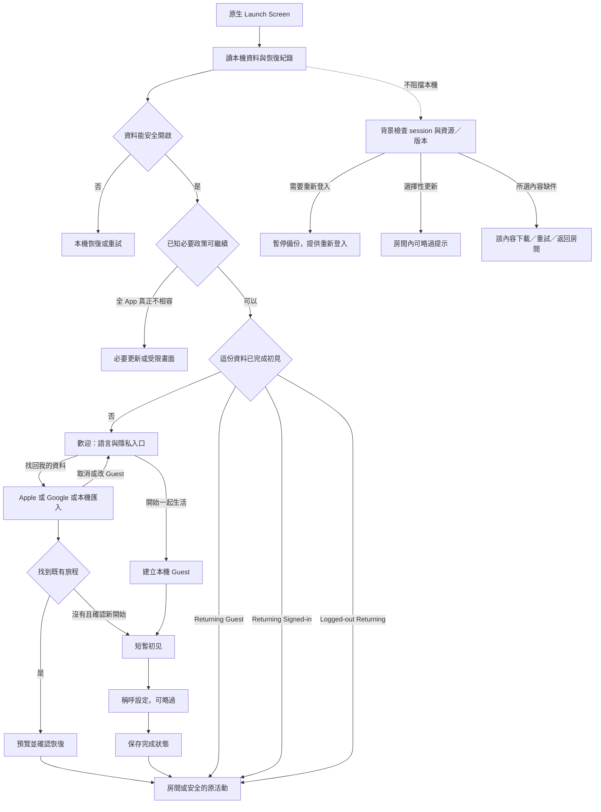
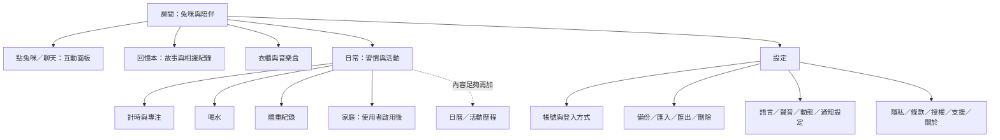
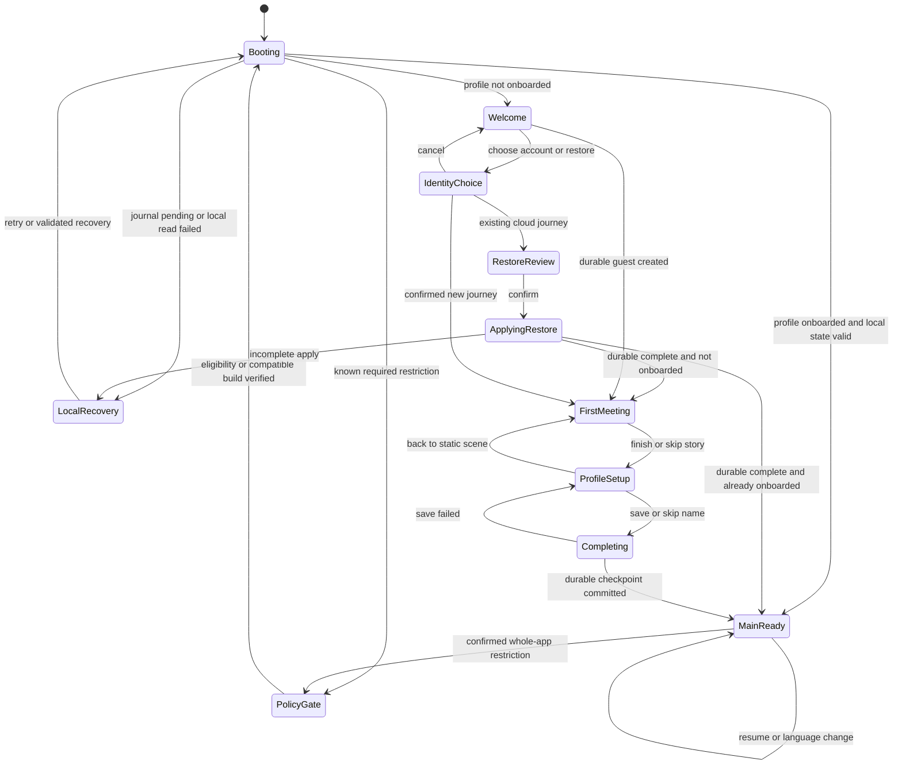
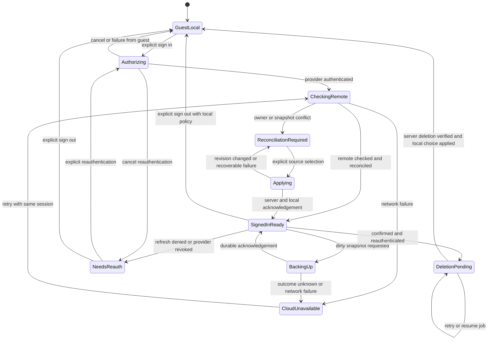

# 兔咪 Entry Experience：產品與架構提案

日期：2026-09-12。狀態：**待使用者確認方向；不是實作完成紀錄，也不是發布授權。**

本輪交付完整產品、UX、狀態機與技術方案；沒有修改 production code、登入供應商設定、正式資料或兔咪素材。文中秒數、尺寸、提示頻率是提議的驗收起點，尚未實測定案。範圍包括首次使用、回訪、帳號與資料延續，以及後續主畫面架構。

查證基準：目前工作區 `codex/tumi-roommate-direction`／`0737a7d`，獨立 redesign `codex/experience-redesign`／`a579d10`，報告分支從本輪 fetch 後的 `origin/main`／`2689934` 建立。三者不是同一份已合併版本。下文以「已存在」「缺口」「提案」區分。

## 1. Executive Summary

**我會做「很快走進有兔咪的家」，不把首次啟動做成註冊與設定關卡。** 首次有情緒、日常有速度、故障有出路、資料有歸屬，才是成熟產品的完整度。

建議定案方向：

1. 保留 Flutter 主體與 iOS 原生整合；不為了入口改寫 SwiftUI。
2. 首次只有歡迎、初見與可略過的稱呼設定。語言在歡迎頁可直接改，隱私摘要可讀；登入、身體資料、通知權限與功能教學按需出現。
3. 「開始一起生活」建立本機 Guest；「找回我的資料」讓既有帳號使用者在初見前恢復。Apple、Google、Guest 都支援，但登入不擋核心陪伴。
4. 回訪直接進房間／恢復活動；不重播 opening、不每天要求按「進入」。Session 與非必要資源檢查在背景完成。
5. 首次不收完整生日。既有喝水／體重估算依賴年齡，改在啟用該功能時處理；法定年齡確認另走最小化政策。
6. 首見、基本角色、房間、必要語言和錯誤 UI 隨 App 打包。先處理大音檔與未使用素材的體積，不先建造強制下載大厅。
7. 正式帳號版必須同時交付備份、恢復、衝突、登出與完整刪除。畫面上「已登入」與「已備份」分開。
8. 房間是首頁；高頻「房間／日常」清楚可達，衣櫃、回憶透過有文字的場景入口進入，設定承接帳號與資料管理。

### Repository 現況與設計依據

| 領域 | 本輪確認的現況 | 設計含義 |
| --- | --- | --- |
| 平台 | `pubspec.yaml`、`lib/main.dart` 為 Flutter；`AppDelegate.swift`／`SceneDelegate.swift` 是 Flutter 原生宿主 | 沒有現成 SwiftUI App 可直接重構；新增同名 SwiftUI 架構會變成雙軌 |
| 啟動 | 主工作區 `_loadStartupState()` 讀 prefs、換日、角色／金幣／衣櫃／故事，`onboardingDone` 分流 | 已有初始化順序，先抽協調器，不另造第二組 Store |
| 啟動錯誤 | `FutureBuilder` 只有 ready 與 splash 分支；有錯誤仍顯示 splash | 必須補可重試的「本機資料開啟失敗」，不能無限等待 |
| 回訪 | 主工作區直接 `MainPage`；redesign 則先到 `AppEntryPage` | 採主工作區快速分流，借用 redesign 視覺，不沿用每次停在入口的行為 |
| 前導 | 主工作區九個 page entry，包含健康／家庭／習慣設定；redesign 有場景與初見流程 | 精簡要按必要性重排；不把舊九頁或 redesign 的頁數當規格 |
| 帳號 | 主工作區沒有 Firebase／OAuth 相依；redesign 有 `AccountService`、`AccountBackend`、`FirebaseAccountBackend`、`AccountBackupPage` | 優先審核移植既有職責，不能宣稱正式版已有真實登入 |
| 雲端可用性 | redesign `AccountCloudConfig` 預設 provider flags 為 false、識別設定由 build defines 注入 | 原始碼存在不等於實際 console、簽名與正式環境可用；本輪未驗證線上服務 |
| 備份 | redesign 有 allowlist、checksum、restore journal、revision comparison、cloud write guard | 值得沿用；checksum 是防毀損，不是加密或身份驗證 |
| 資料 | prefs 為主要儲存，`LogicalDayCoordinator`、`PreferenceWriteGuard` 管協作；多數舊資料未按帳號分區 | 身份切換前，必須先處理本機資料 owner 與一致性 |
| 語言 | 中英 ARB 已存在；兩工作區 `MaterialApp.locale` 都固定 `zh_TW`，僅 dev override；未有日文 ARB | 「有翻譯檔」不等於可選語言或已完成海外版 |
| 舊識別鍵 | 部分習慣預設、性別、活動量用中文字串比對；角色台詞／故事仍有硬編碼中文 | 先給內容穩定 ID，不能直接翻譯儲存值 |
| UI | 六個分頁：習慣、計時、喝水、體重、家庭、衣櫃；有 `MascotPageShell` 和房間場景 | 新 IA 需保留原功能與路由遷移，不以入口改版名義移除資料或功能 |
| Token | `app_style.dart` 有字色、表面、圓角、陰影、按壓；音訊與 feedback 已集中 | 擴充語意層，不建立平行 Design System |
| 可及性 | 全域 text scale 被 clamp 到 1.0–1.3；部分動效已處理 Reduce Motion | 登入／法律／設定必須能大字重排，不能沿用上限來掩蓋破版 |
| Native launch | storyboard 是整頁 `LaunchImage` aspectFill，Flutter splash 的角色為固定布局 | 多尺寸可能接縫跳動；改成簡單共用底色／固定元素，取消整頁圖縮放依賴 |
| 素材 | 核准 CG 差分、四時段房間、打包字型；主工作區有 moon pajamas | 保留身份與既有 pose，不重啟已停止的骨架試驗 |
| 體積 | 本輪 `du -sh`：sounds 約 73 MB、mascot 15 MB、scenes 11 MB、music 7.9 MB、fonts 2.8 MB | 是來源目錄磁碟量，**不是 IPA／商店下載大小**；先量壓縮與實際首屏引用 |

原始碼證據以固定 commit 查閱：[主工作區 main.dart](https://github.com/RarakuMoai/habit-app/blob/0737a7d25bfe544b53aba6c41e11e33fd98fbb08/lib/main.dart)、[原 onboarding](https://github.com/RarakuMoai/habit-app/blob/0737a7d25bfe544b53aba6c41e11e33fd98fbb08/lib/pages/onboarding_page.dart)、[原 token](https://github.com/RarakuMoai/habit-app/blob/0737a7d25bfe544b53aba6c41e11e33fd98fbb08/lib/utils/app_style.dart)、[redesign 入口](https://github.com/RarakuMoai/habit-app/blob/a579d106bd7c6b27350fb7b409f0c20ee8e43f2c/lib/pages/app_entry_page.dart)、[AccountService](https://github.com/RarakuMoai/habit-app/blob/a579d106bd7c6b27350fb7b409f0c20ee8e43f2c/lib/utils/account_service.dart)、[Firebase adapter](https://github.com/RarakuMoai/habit-app/blob/a579d106bd7c6b27350fb7b409f0c20ee8e43f2c/lib/utils/firebase_account_backend.dart)、[BackupArchive](https://github.com/RarakuMoai/habit-app/blob/a579d106bd7c6b27350fb7b409f0c20ee8e43f2c/lib/utils/backup_archive.dart)。

也檢視了 redesign 留存的 `review_v4/01-arrival.webp` 與 `07-home.webp`：溫暖 CG 與角色身份可沿用；首頁仍被功能面板和六分頁占據相當視覺份量。這是既有截圖的構圖判讀，**不是本輪新跑模擬器，也不是新版已驗收**。

文件有歷史落差：主工作區 roadmap／prelaunch 仍寫無替換造型，但 `0737a7d` 已整合睡衣；visual spec 的 soft 色碼與實際 `#837161` 不同；l10n 設定提到已不存在的舊遷移文件。報告按程式修正判讀，不跨分支修改與本輪無關文件，也不把開發者會員的歷史敘述當帳號現況。

### 品質 benchmark 的實際用法

採成熟遊戲的場景連續性、角色反應因果與資源可恢復性；採 consumer app 的少步驟、狀態還原和權限按需；採 iOS 的系統授權與滑回慣例。不借用任何遊戲的圖像、音樂或版面。本輪沒有進行特定遊戲的實測競品評分。

以可驗收結果取代「像大公司」：首次離線可到房間、回訪零必要點擊、取消登入零資料變動、被中斷可續行、沒有假備份成功、英文／日文與大字可操作、過場不遮蔽錯誤。

## 2. Proposed App Entry Flow

核心流程在沒有地區法定阻擋時如下。網路檢查不是所有路徑的串行前置。

| 情境 | 路徑與判斷 | 使用者看到什麼 |
| --- | --- | --- |
| First Launch | 原生 → 本機必要初始化 → 歡迎 → 初見 → 稱呼可略過 → 房間 | 主路徑無登入與健康表單；語言入口一直可見 |
| Returning Guest | 原生 → 本機恢復 → 房間／原活動 | 不再顯示歡迎；可在資料管理主動綁定 |
| Returning Signed-in | 原生 → 本機 owner 檢查 → 房間，SDK 恢復與更新憑證 | 有效 session 不出登入頁；登入成功不自動下載覆蓋本機 |
| Logged-out Returning | 原生 → 使用者明確保留的本機副本 → 房間 | 不自動重新登入已登出的帳號；雲端備份關閉 |
| Offline Launch | 新用戶仍可完成本機初見；舊用戶開啟有效本機存檔 | 線上操作時才提示離線，沒有全屏斷網封鎖 |
| Mandatory Update | 後端不支援舊協定時先停用雲端；只有本機核心不安全才全 App gate | 說明原因、更新／重試／支援；可安全匯出資料時保留出口 |
| Optional Update | 直接進房間，必要時在非忙碌時段顯示一張可略過卡 | 不在每次啟動彈窗；按 release ID 記錄略過 |
| Asset Download Required | 僅當使用者打開未具備的內容包，或必要本機快取損毀且無 bundle fallback | 真實下載量、取消回房間；不為季節素材封鎖主 App |
| Session Expired | refresh 成功透明續用；無網路標 unavailable；失效／撤銷才標 needsReauth | 本機可用，備份暫停；登入提示留在帳號／待備份卡 |

Gate 優先序：本機恢復完整性 → 已確認的安全／法定使用限制 → 必要內容相容性 → 首次體驗。遠端取不到資料不等於 mandatory update；已知的安全撤回也不能因離線被當作可用。政策快取需帶版本、適用範圍與有效期，失效時保留安全本機功能並停用受影響雲端功能，不用「整個 App 都必須更新」掩蓋錯誤。

## 3. Screen Inventory

MVP 指可封閉測試的完整本機入口；帳號若列入公開版，標示「帳號版必要」的項目全部升為 release gate。狀態盡量在原畫面呈現，不為每種錯誤增加一個 route。

| 畫面／呈現 | 分級 | 備註 |
| --- | --- | --- |
| 原生 Launch + App 內 startup surface | MVP | 靜態系統畫面與真實初始化分工 |
| 歡迎／開始／找回資料 | MVP | 不做三頁品牌簡報 |
| Language sheet | MVP | 首次與設定共用；只列正式可用語言 |
| 初見場景／短字幕 | MVP | 一場景，非多章 opening |
| 稱呼設定 | MVP | 可略過，日後改名 |
| 房間與第一件日常入口 | MVP | 初見後可直接操作 |
| 本機啟動錯誤／恢復 | MVP | retry／匯入；不直接 reset |
| Privacy／Legal／Support center | MVP | 本機可讀的核心內容＋公開網址 |
| Settings：語言／聲音／動態／資料 | MVP | 沿用共用 sheet／route |
| 本機匯出／匯入／清除確認 | MVP | 沿用 redesign，先驗證資料完整性 |
| Apple／Google／Guest 選擇 | Recommended；帳號版必要 | 系統授權在供應商 UI 進行 |
| 連線中／取消／失敗／成功 | Recommended；帳號版必要 | 原頁 state，不四張新頁 |
| 帳號與備份狀態／綁定方式 | Recommended；帳號版必要 | 顯示最後成功時間及待處理變更 |
| 本機與雲端旅程比較 | Recommended；帳號版必要 | 不能自動合併情感進度 |
| 重新驗證／登出／刪除及刪除中 | Recommended；帳號版必要 | 包含拒絕、失敗、部分完成恢復 |
| 必要更新／維護受限 | Recommended | 線上服務啟用前完成最小版本 |
| 選擇性更新卡 | Recommended | 一次、可稍後 |
| 下載內容 sheet／儲存空間錯誤 | Future；首個 remote pack 上線前必要 | 同一 sheet 覆蓋進度與重試 |
| 年齡範圍／家長核准 | 條件式必要 | 發行市場／功能觸發時不能延期 |
| 活動日曆／通知中心／季節 Opening | Future | 有內容與通知量再成立 |

## 4. First-Launch UX

### 共用構圖契約

帳號 onboarding 負責清楚與可信；角色 onboarding 才負責情緒。法律、下載失敗、資料比較由系統文字說明，不讓兔咪代言服務保證，也不用難過表情催登入。

以既有暖房間和核准兔咪為視覺核心。保留場景留白和字幕安定區，不同時放 logo reveal、鏡頭推移、光束、粒子、角色跳躍。現有背景已畫好光線，首版只做場景淡入與姿勢切換，不疊第二道光。

布局採 `SafeArea → 最大寬度容器 → 可捲動內容＋底部操作`。redesign 現況為 maxWidth 540、水平 28；在寬度 375 的手機，主要內容寬 319，在 430 為 374，在平板上限為 484。新設計先沿此約束做樣品，再因大字需要重排；鍵盤視窗以 `viewInsets` 扣除，不靠縮字或固定百分比把 CTA 推出畫面。

以下文案為繁中提案，實作前寫入 ARB／對話目錄，並取得日英語意審校。

| 畫面 | 目的、主視覺與兔咪 | 動畫與文字 | CTA、Back、Skip | Error／下一步 |
| --- | --- | --- | --- | --- |
| L0 原生啟動 | 系統接管前提供連續底色；無新增角色演出 | 暖色靜態背景，匹配 App 第一幀；無在地化文字或進度 | 無操作；不能人為延遲 | 交給 L1；系統期不播放長片 |
| L1 必要初始化 | 開啟有效本機資料；必要時小型安靜等待符號 | 短工作不出 loading；較久顯示「正在準備你的房間」且無假百分比 | 慢且失敗後提供「重試」「找回資料」 | 本機讀寫失敗顯示可操作恢復；完成到 W1 或回訪房間 |
| W1 歡迎 | 小屋入口／室內留白，這張不放搶眼大表單；兔咪可暫不出現，保留初見 | 「和兔咪，一起開始新的日常。」；短揭示，主按鈕可立即按。下方「先在這台裝置開始，也能之後備份。」＋隱私連結 | 主「開始一起生活」；次「找回我的資料」；另有「帳號選項」、語言和靜音。根頁無 Back；主 CTA 即 Guest 路徑 | 本機 Guest 建立失败原頁重試；成功 M1；找回走 A1／匯入 |
| W2 語言 sheet | 自稱語言名稱：繁體中文／日本語／English／跟隨系統；無角色 | 選擇立即預覽當頁翻譯；不靠國旗表示語言 | 點選套用；關閉回原位置。Back 關 sheet；不要求選完才能開始 | 儲存失敗告知「已暫時切換，尚未儲存」並可重試；不重啟或清除草稿 |
| W3 隱私／使用資訊 | 易讀文字與資料流示意，無角色遊說 | 短摘要可展開全文、版本與更新日期；本機玩法與線上備份分開說 | 「關閉」返回；不以勾選「同意隱私政策」假裝所有處理都有同意 | 公開頁失敗仍有隨包版本，標明版本；回 W1，不丟失選擇 |
| A1 帳號選項（自願） | 小屋背景＋安定不透明面板；兔咪小幅陪伴、不做成功承諾 | 「找回你的日常」或「保護這段日常」按進入目的替換；說明登入與備份的分別 | Apple、Google 等寬等級；「先以訪客開始」。Back 返回來源；OAuth 取消回原狀 | 失敗保留本機旅程；有存檔到比較／恢復，空帳號確認後進 M1；已完成初見的恢復直接房間 |
| M1 第一次見面 | 使用現有房間與核准 pose，兔咪在地毯錨點；無門動畫新素材依賴 | 場景穩定 → 兔咪察覺 → 一聲 MI → 字幕。「我也剛搬來。」「這裡……還有你的位子。」；使用者點一下補全字幕 | 主「一起開始吧」；「略過故事」從開始即可用。Back 回歡迎並保留狀態；不恢復播放已略過片段 | 圖像缺件 fallback 原核准 pose；音訊失敗仍能讀／進行；下一步 N1 |
| N1 稱呼 | 延續同一房間，輸入面板不壓兔咪臉；預設名字兔咪，玩家暱稱可空白 | 「要怎麼稱呼你？」；「之後也能修改。」；不問真實姓名或 email | 主「就這樣開始」；次「稍後設定」。Back 回初見定格；Skip 使用預設稱呼 | 支援輸入法組字、grapheme 長度與本機驗證；寫入失敗留原頁；成功一次保存 checkpoint 後 H1 |
| H1 房間落地 | 兔咪留在相同錨點，日常 UI 在可讀安全區出現 | 「今天，先做一件小事。」；不再出登入成功、歡迎禮、權限三連彈窗 | 「選一件小事」或直接和兔咪互動；教學可關閉。Back 不回 onboarding | 新增失敗保留輸入；空狀態正常可停留，沒有被迫先建習慣的門檻 |

「初見」建議自然閱讀約 15–25 秒、動畫占約 3–5 秒；無強制倒數，可即時略過，閱讀慢的人不自動被推走。完整故事序章留在回憶本，初見不是把六幕故事再播一次。若恢復既有旅程，顯示短暫「回來了」即可，不重演陌生人第一次相遇。

登入在初見前由使用者主動選擇時，成功直接接初見，不再新增慶祝頁；初見後才綁定時，成功接回原房間，不重設相識日。

## 5. Returning User UX

日常冷啟動只做必要本機讀取與最短場景接手；取消 redesign 的每日 `AppEntryPage` 停留。Warm resume 優先恢復計時、未提交編輯或原功能，不能只為品牌一致每次踢回房間。

本機資料、邏輯日與恢復 journal 是真正 prerequisite；帳號網路、選擇性 manifest、音樂暖機不是。初步目標：本機 ready 後 250 ms 內交出可操作介面；暖返回不追加 opening。這是待量測 budget，不能保證總冷啟動秒數。

Guest 的備份提示提議在**累積第一筆有意義的回憶後，下一個安靜時機**顯示一次可關閉卡；略過後至少七天不自動再提示，手動設定入口保留。提示不與完成演出重疊，也不說「不登入兔咪就會離開」。顯示「目前存放在這台裝置」及「設定備份」，避免假安全感。

Signed-in 在房間內只需低干擾狀態：「已備份：日期時間」「有變更尚未備份」「需要重新登入」。備份錯誤不改兔咪情緒。重大更新的 What's New 在主畫面安定後一次顯示；特殊 Opening 以可略過／可重播內容處理，不能重設首遇進度。真正涉及法定重大變更的 acknowledgment 則按地區政策处理，不能當普通 What's New 略過。

## 6. Authentication Architecture

### 身份、旅程、備份是三件事

沿用 redesign `AccountService`＋`AccountBackend`＋Firebase adapter；保留原生 SDK 驗證。不建自家密碼系統，不把 Apple／Google ID token 當 app 內永久通行證。初期 backend 建議一個 Firebase 專案的正式環境，加獨立開發環境與權限規則；不因現有程式方便就讓測試與正式資料共用 namespace。

**Guest 採純本機 profile，不在第一次離線啟動強制建立 Firebase anonymous user。** `localProfileId` 是隨機 ID；登入後取得穩定 app UID，provider subject 與 UID 映射由 Firebase 維護。`email`、Apple relay email、暱稱不可作為合併主鍵。

資料模型最低需要：`profileId`、`ownerUid?`、`provenance`、`localRevision`、`lastAcknowledgedCloudRevision`、`onboardingVersion`、`firstMeetingStatus`。身份／憑證在 SDK 與 Keychain；內容快照不包含 token、PIN、session flags。UID 與 revision 是 metadata，不是授權憑證。

### Guest → Apple／Google：保留旅程的交易流程

1. 取得 mutation barrier，讀取已落盤版本，建立可恢復的本機 snapshot；開始 `operationId`，記錄來源 profile 與預期 UID。
2. 呼叫選定 provider。取消只是回原頁；尚未授權／網路失敗時不改 owner、不上傳、不清除資料。
3. SDK 登入成功後，**先讀雲端 head**。UI 可寫「已登入，正在確認備份」，不能先寫「資料已保護」。
4. 確认是本機 Guest 且雲端沒有旅程：顯示備份範圍；使用者選「備份這台裝置的日常」，以 expected revision 0 發布 snapshot。資料 scope／同意完成前不整包上傳。
5. 雲端有旅程：進比較頁。展示兔咪名字、相識日、最近記錄時間、內容摘要及備份時間；不顯示只有工程師懂的 UID。
6. 「使用雲端旅程」先保存本機復原副本，stage → 驗證 schema/checksum → 套用 → 重讀所有 Store → 確認 → 完成。失敗不把本機標為已恢復。
7. 「使用這台裝置的旅程」明確說明將替換哪份雲端現用旅程；以 CAS revision 發布，保留前一個可恢復版本。另一裝置先寫入則返回比較，不 last-write-wins。
8. 成功 ACK 且本機 metadata 保存成功後才切 owner／顯示備份時間。若 ACK 狀態未知，重新查 operationId／head 決定結果，不盲目重送製造雙快照。

一開始**不做兩份旅程自動合併**：金幣、解鎖、相識日、家庭資料與每日完成有衝突語意，「取最大值」也可能重複發獎。保留一份現用與一份可恢復副本比假裝無縫合併可靠。

### Provider linking 與 account collision

| 操作 | 語意與結果 |
| --- | --- |
| Guest 登入全新 Apple／Google | Firebase 登入／建帳號＋本機旅程的明確備份，不是對不存在的 anonymous user 呼叫 link |
| Apple 用戶新增 Google | 對**目前相同 UID**呼叫 provider linking；成功保持相同旅程 |
| Google credential 已被另一 UID 使用 | 不自動合併或依 email 猜人；取消連結，讓使用者選原帳號登入，再明確切換／比較旅程 |
| 想移除最後一種 provider | 不允許把可恢復帳號變成無登入方式；先新增另一方式，或使用刪除帳號流程 |
| 登入不同帳號但本機屬於舊 UID | 不把前一人的資料自動上傳；保留 owner lock，明確顯示帳號切換與資料來源 |

Firebase 支援將多個 provider 連到同一使用者；credential 已被使用時需要額外解決流程。這不會自動替產品合併兩份存檔。[Firebase account linking](https://firebase.google.com/docs/auth/flutter/account-linking)

### 登入 UI 狀態

`idle → authorizing → checkingBackup → ready / reconciliationRequired`。失敗映射為可翻譯 code：`networkUnavailable`、`providerUnavailable`、`authorizationFailed`、`credentialInUse`、`reauthRequired`、`backupConflict`；不把完整 exception、email、token 印在 UI／log。

Loading 留在原按鈕附近，防止重複啟動 OAuth；Apple／Google 品牌按鈕不變造成型進度條。操作超時回到可用畫面並使舊 callback 失效，不能只在 UI timeout 卻讓晚到回呼偷偷切帳號。

Google 採官方 iOS SDK 的登入／restore 流程與最小身份 scopes；不要求 Drive、Calendar 或聯絡人，OAuth 設定須有真實支援與隱私網址；不用自建 WebView 收憑證。[Google iOS integration](https://developers.google.com/identity/sign-in/ios/sign-in)、[OAuth policies](https://developers.google.com/identity/protocols/oauth2/policies)

### 登出、失效、刪除

- **明確登出**：先告知「停止此帳號在這台裝置的備份」，可明確選擇保留本機副本／移除此裝置資料；保留時標記來源且不能自動轉交另一 UID。取消不動任何資料。清掉 SDK session 與登入意圖，延遲 callback 無效。
- **Session expired**：先由 SDK refresh。暫時網路錯誤不等於身份被撤銷；真失效只停雲端，不清 prefs。系統確認撤銷／禁用後清除憑證，顯示 needsReauth。
- **刪除帳號**：設定內可直接發起，說明雲端旅程、provider link 與本機副本的處理。重新驗證後建立可追蹤 delete job，先停止新寫入，再刪雲端所有 snapshot／子集合，撤銷 Apple token／解除 provider 授權，刪身份，最後回報完成。順序需按供應商能力保留足夠權限，不能先刪 Auth 讓剩餘資料無法清。
- **不完整刪除**：顯示「刪除處理中」與 job receipt，可重開續查；server tombstone 擋住其他裝置以舊 token 復活資料。離線不宣稱已刪除；未送達需使用者重試或走已公開支援管道。
- **本機副本**：刪除頁讓使用者明確選擇同時移除或保留獨立本機副本，不暗中保留。臨時復原檔、匯出檔與系統備份的差別要說清楚；開發者不能遠端收回使用者自行保存的檔案。

Apple 要求帳號刪除可從 App 發起，不能只停用帳號；Sign in with Apple 的相關 token 也需撤銷。一般產品不應要求使用者寄信才能完成。[Apple account deletion](https://developer.apple.com/support/offering-account-deletion-in-your-app/)

現有 redesign 的 client 刪除與備份服務是可用基礎，不足以證明跨裝置／部分失敗均已可靠。本提案要求的 durable delete job、明確 owner 與本機副本政策，需要在公開帳號版前補齊驗證。

## 7. Localization Architecture

使用 Flutter `gen-l10n`＋ARB，擴充一個 `LocalizationController`，不新增平行字典。它提供 `LocalePreference(system / explicit)` 和 `resolvedLocale`，由 `MaterialApp` 訂閱。解析順序：已存手動選擇 → 系統 preferred locales 的受支援 script／language → 產品 fallback（建議海外版 English）。App Store storefront 不參與此算法。[Flutter internationalization](https://docs.flutter.dev/ui/internationalization)

| 領域 | 方案 |
| --- | --- |
| 語言識別 | 繁中標準化為 `zh-Hant`，保留必要的 `zh` base；日文 `ja`，英文 `en`。不把 `zh` 不加判斷地當簡中，也不以 `JP` 決定日文 |
| 首次選擇 | 系統自動偵測，歡迎頁顯示目前語言名稱可改；不設必經語言全屏 |
| 後續變更 | Settings 共用同一 sheet；點選即時重建文案，route、輸入與 scroll state 保留 |
| 系統變更 | 只有 preference=system 才跟著變；明確手選繁中不被 iPhone 日文覆蓋 |
| 存放位置 | device preference，不由雲端旅程還原覆寫目前選定語言；匯入舊備份保留當前 preference |
| 文案 | onboarding／auth／legal／errors 全部 ARB；placeholder、plural、日期／數字格式在 locale 層處理，禁止字串串接 |
| 故事 | `storyId`／`lineId` 與翻譯分離；MI 語音沿用，字幕翻譯，不為每種語言重新發明角色人格 |
| 儲存鍵 | 新 preset 用 stable ID；舊中文識別值做版本化映射；使用者自己取的名字不翻譯 |
| 法律文件 | `documentId + version + locale + effectiveAt`；語言變更不自動視為新同意，實質條款版本才重評估 |
| Font | 沿用 bundled Nunito／Baloo，CJK 使用明確系統 fallback；不為換語言下載阻塞首屏的字型 |
| 完整度 | 日文沒審完不在正式版顯示為可用；中英 missing key CI gate，角色與法律也在範圍內 |

系統授權 UI 的語言受 iOS／provider 控制，不能承諾完全跟隨 Flutter 手選；App 自有說明、錯誤與按鈕用已選語言，並檢查 iOS localization declarations。語言、計量單位、時區、法規適用地區是四個狀態，不互相替代。

驗收需以 375×667、393×852、430×932 logical points，加上平板支援範圍，跑三語、長名字、鍵盤、VoiceOver 與大字。取消 1.3 的全域文字上限，改成內容捲動／按鈕多行／場景高度讓位；法律與錯誤不能截斷。產品按鈕建議至少 48 高，觸控區至少 44×44，供應商品牌按其規範實作。

## 8. Privacy / Legal Requirement Matrix

以下依 2026-09-12 本輪讀到的 Apple／Google 官方頁面與主管機關資料分類；是產品實作矩陣，不是所有國家都已完成的法律審查。正式發行國家、營運者與實際資料流尚未定案，不能宣稱全球合規。

| 項目 | 分類與觸發 | 首次主動呈現 | 常設位置／工程要求 |
| --- | --- | --- | --- |
| Privacy Policy | **App Store 必要** | 歡迎頁短摘要＋可點連結；不強制讀十頁 | App 內易達、公開 HTTPS URL；收集者、用途、第三方、保存／刪除與聯絡方式 |
| App Privacy labels | **App Store 必要** | 不是新的一頁同意畫面 | 商店填報實際 App＋SDK 行為；線上備份開啟後不能仍沿用全本機標示 |
| Privacy manifest／required-reason APIs | **依 API／SDK 必要** | 不給使用者讀 plist | 檢查 app 與第三方 SDK 的 manifest／簽章／允許理由；與隱私政策分工 |
| Terms of Use／Service | **產品強烈建議；Google OAuth 對外首頁需相關連結** | 本機開始可查看；建帳號／啟用雲端時清楚提示適用條款 | 一份簡短條款交代服務、備份限制、支援、終止與權利，不做重複十份文件 |
| EULA | **採 Apple 標準即可** | 不另設必經 EULA 全頁 | Legal Center 可查；有特殊授權需求才做 custom EULA |
| Data Collection Notice | **實際收集／適用法律時必要** | 在備份、健康資料或相關能力啟用前就地說明 | 用途、資料類別、接收方、範圍與拒絕影響；不以「繼續」包辦所有選擇性處理 |
| Age／parent notice | **市場、兒少受眾、能力觸發時必要** | 只對適用流程顯示，須在受限處理前 | 年齡分類、來源與有效性；家長 PIN 不等於有效家長同意 |
| Open-source／fonts／media licenses | **實際授權條款要求時必要** | 無需啟動彈窗 | About → licenses；沿用 LicenseRegistry，盤點 CG、音檔與每个 SDK 的授權 |
| Third-party SDK notice | **依資料流／條款必要** | 第三方登入、備份時短說明 | 可合併於 privacy 與 licenses，不建重複 SDK 廣告頁 |
| Account deletion | **開放建帳號即必要** | 不在第一屏展示破壞性操作 | Account → Delete；包含伺服器、provider 與本機選擇，參第 6 節 |
| Data deletion | **適用隱私權利必要；本機控制亦為 MVP** | 收集摘要可連到管理頁 | 區分清除本機、刪除雲端旅程、刪除帳號，不以相似文案混用 |
| Data export | **產品強烈建議；依法適用的可攜／存取權需履行** | 無需首次索取選擇 | 提供可讀 JSON＋還原格式，未必為第一版加 CSV；不是所有 App 的普遍 Apple 必備畫面 |
| Contact／Support | **商店與服務可信度必要** | Legal 可見 | 真實支援 URL／可用聯絡方式；不放 placeholder，不把回應時效寫成做不到的承諾 |
| Notifications permissions | **用到時必要** | 首次不彈 | 使用者設定第一個提醒時再解釋並請求；拒絕仍可陪伴與手動操作 |
| Tracking／ATT／marketing consent | **目前不需要；將來實際追蹤才需評估** | 不放裝飾性的 tracking 彈窗 | 無廣告方向維持；登入本身不等於要 ATT |
| AI sharing／UGC／subscription notices | **未來有相關功能才需要** | 不預先捆綁接受 | 第三方 AI 分享需專門透明告知與許可；UGC／訂閱另做完整能力審查 |
| 完整生日同意書／每次啟動條款重勾／無追蹤仍出 cookie banner | **目前不需要** | 不出現 | 不以多頁文件替代實際資料保護 |

Apple 主要依據：5.1.1 的隱私政策／資料最小化與非必要帳號限制；4.8 的第三方登入等價選項，本案採 Apple＋Google；5.1.2 的第三方個資分享與 AI 透明許可。各條件按实际功能適用，不解讀成所有 App 必須收生日。[App Review Guidelines](https://developer.apple.com/app-store/review/guidelines/)

隱私標示中，純裝置處理與傳出裝置的收集不同；新增雲端備份後，要重新盤點帳號識別、使用者內容、健康／健身資料與 SDK diagnostics。選擇性雲端功能也不能直接從 disclosure 消失。[Apple App Privacy Details](https://developer.apple.com/app-store/app-privacy-details/)

隨包的 privacy manifest 是開發者與 SDK 對 API／資料用途的描述，不是使用者同意書。[Privacy manifest files](https://developer.apple.com/documentation/bundleresources/privacy-manifest-files)、[Required reason APIs](https://developer.apple.com/documentation/bundleresources/describing-use-of-required-reason-api)

未提供自訂 EULA 時 Apple 標準 EULA 適用，無須為形式感自寫一套。[Apple EULA 說明](https://developer.apple.com/help/app-store-connect/manage-app-information/provide-a-custom-license-agreement/)

Google OAuth 需正確的品牌、支援、首頁與隱私／條款資訊，正式 OAuth 發布及品牌驗證須依 console 的實際要求完成；登入 scopes 與額外敏感 scopes 的審查不能混為一談。[OAuth policies](https://developers.google.com/identity/protocols/oauth2/policies)、[Brand verification](https://developers.google.com/identity/protocols/oauth2/production-readiness/brand-verification)

### 建議的一個 Legal Center

「隱私與資料」→ 隱私政策／資料範圍與管理；「使用條款」→ 服務條款／標準 EULA；「授權與支援」→ licenses／第三方資訊／聯絡方式。法律文字可捲動、有標題與閱讀順序；不同意選擇性雲端資料處理仍可用本機。

需要明確接受的服務條款，在可能建立線上帳號的 OAuth 操作前顯示適用版本與清楚的接受動作；不要改寫 provider 的品牌按鈕文字，可在同一帳號面板先確認條款後啟用登入按鈕。Firebase 首次 sign-in 可能同時建帳號，不能等它返回才補問建帳號條款。保存 `documentId、version、acceptedAt、locale、purpose`；選擇性的備份範圍另記同意／撤回，不混成一個永久 consent boolean。一般隱私告知的「已呈現」與法律上需要的「已同意」分開。

臺灣個資法的告知與當事人權利需列入產品流程；第 8 條涵蓋蒐集目的、類別、利用範圍、權利與不提供的影響，第 3 條涉及查閱、更正、停止與刪除等權利。正式版本應按營運者和實際適用範圍核對現行生效條文。[全國法規資料庫](https://law.moj.gov.tw/LawClass/LawAll.aspx?pcode=I0050021)

## 9. Birthdate / Age Recommendation

**首次陪伴流程選 E：不要求生日、出生年或年齡表單。完整年月日不應是走進房間的門票。** 但這是本產品基礎體驗的選擇，不是全球無年齡義務的判定。

| 選項 | 判斷 |
| --- | --- |
| A 完整年月日 | 不採用為 onboarding 必填；未見首遇功能需要精確年月日 |
| B 出生年份 | 比完整生日少，但對單纯陪伴仍多餘；估算年齡也有生日未到誤差 |
| C 年齡區間 | 區域法規／能力分流時優先；不能拿區間作精確生理估算 |
| D 達最低年齡 | 僅當適用規則只需要 eligibility；自勾不能替代要求更強驗證的法律 |
| E 不收 | 本機房間、一般習慣與故事首見採此路徑 |

### 不能忽略的既有健康功能

`water_page.dart` 用 `userBirthday` 推導兒童／高齡水量分支；`weight_page.dart` 用年齡於 BMR 估算。提案是**移到功能啟用時詢問最少必要資訊**，不是把生日刪掉後讓年齡=0 靜默套成人公式。

首版可先提供「自己設定目標／只記錄」而不收年齡。若提供估算，再說明所需年齡與限制；可用使用者輸入的目前年齡＋填寫時間，過期再確認，不假裝會按精確生日自動增加。兒童不自動套成人體重／熱量建議。這一層需另做健康內容有效性審核，本報告不認證現有公式。

既有完整生日保留相容讀取；經使用者選擇刪除或遷移後再清除，不在更新時擅自抹掉。生日祝福若以後確定需要，只問可選月日，與法規年齡分開，允許不填或隨時改。

### 年齡確認的最小資料

如適用市場要求，優先接 Apple Declared Age Range：保存所需 band／eligibility、來源、取得時間、政策版本與可重新檢查狀態；不另收證件／完整生日、不把年齡轉成行銷分群。SDK 可用性、拒絕分享、未知與撤銷都要有狀態；未知不能默認成年。

Apple 現有年齡工具有地區性的法定要求；標示 18+ 也不免除適用地區的 API 要求。iOS 26、26.2、26.4 的相關能力不同，需按實際部署版本做 availability 分支；不能只接初版 API 便宣稱涵蓋所有情況。[Apple age assurance Q&A](https://developer.apple.com/support/age-assurance/)

| 發行／受眾 | 本輪可得的結論 | 上線前仍需確認 |
| --- | --- | --- |
| 台灣起步 | 不為成熟感收生日；按個資法與實際功能告知 | 明確發行市場、資料控制者、兒少可使用的線上能力 |
| 日本 | 同意能力判斷不是全球統一的 13 歲；PPC 要求按資料與事業性質判斷 | 日本上架前核對當時已生效法律與家長流程，不能沿用美國門檻。[PPC Q&A](https://www.ppc.go.jp/all_faq_index/faq1-q1-62/) |
| 美國 | COPPA 涵蓋針對未滿 13 歲，以及實際知悉正在收集該年齡兒童資料的情境 | 成人使用家庭功能與兒童本人操作要分開；可愛角色／兒童導向也是評估因素。[FTC 六步指南](https://www.ftc.gov/business-guidance/resources/childrens-online-privacy-protection-rule-six-step-compliance-plan-your-business) |
| 歐盟 | 直接提供兒童線上服務、以同意作處理依據時，門檻依會員國落在 13–16 歲 | 不能把所有處理一概等同 consent；核對市場、法律依據與監護人流程。[European Commission](https://commission.europa.eu/law/law-topic/data-protection/information-business-and-organisations/legal-grounds-processing-data/are-there-any-specific-safeguards-data-about-children_en) |
| 其他／美國州級規則 | 年齡工具與上架分級不等同本人同意所有資料處理 | 每次擴市場前查最新官方生效／禁制令狀態，不將舊公告日期寫死成全域策略 |

產品建議先以一般陪伴及成人自行管理的日常／家庭工具定位，**不是直接面向兒童的線上聊天服務**；此為待確認方向，行銷與實際內容仍決定適用性。沒有兒少雲端合規能力時，受限使用者保留安全本機功能，禁止對其偷偷啟用登入／上傳。不能靠忽略已知年齡迴避義務。

現有家庭 profile、身體資料、生日預設不放進新的「陪伴備份」scope。線上備份只先包含兔咪旅程、衣櫃、回憶與使用者選擇的日常內容；後續若要含健康／家庭資料，先完成另層資料清單、權利與同意設計。這是對 redesign 整體 allowlist 備份的**待核准 scope 調整**，不能只換 UI 文案就宣稱已排除。

## 10. Asset Download Architecture

### 先決定該不該下載

首版主路徑必須完全可離線。先量首屏 decode、啟動 I/O、音檔編碼與 release 包大小，再決定拆包。現有約 73 MB sounds 是明確的盤點候選，但未查引用與音質前不刪；大公司會下載，不代表兔咪現在需要一套下載系統。

| 素材 | Bundled Essential | Downloadable／Optional | 理由 |
| --- | --- | --- | --- |
| 兔咪基本表情 | 核准 baseline、睡眠／基本反應、缺件 fallback | 新套装完整 pose pack | 不能在開門後看到空角色；一套衣服完整才啟用 |
| 房間／初見 | 第一個房間、短初見所有圖片 | 季節房間、額外章節 CG | 已有基礎房間就能陪伴 |
| 動畫 | Flutter 程式與必要圖隨 App | 大型預渲染片段 | 不下載執行碼或改核心行為的腳本 |
| 音訊 | 最小互動 SFX、短 MI、首遇需要的短音訊 | 額外 BGM、長音軌 | 靜音仍可完成所有流程；音樂不能卡登入 |
| 字型／UI 語言 | 首版所有正式支援語言、按鈕／錯誤／法律、必要字型 | 長篇故事翻譯 content pack | 語言不能因斷網消失；機器操作與內容下載分離 |
| Remote config | 隨包預設安全值 | 有界的內容開關、版本 metadata | 未連線不阻擋本機；不做任意遠端邏輯平台 |
| Cached assets | 已驗證的選配內容可本機留存 | 最近使用／使用者固定保留 | Cache 不是唯一存檔，不能和旅程同路徑清除 |

### 最小可維護方案

第一個 remote pack 上線時才新增 `AssetRepository`（對外 resolve）＋`ContentDownloader`（下載），背後一個 object storage／CDN、一份版本化 manifest。不要同時建 CloudKit assets、Firebase Storage 和自家 CDN 三套解析邏輯。可沿用現有 Firebase 生態，選定一種供應商；本輪不選定價格或開通帳務。

Manifest 至少包含 `schemaVersion`、`manifestVersion`、`packId`、`contentVersion`、`minAppBuild`、`locale?`、檔案清單的 `relativePath / bytes / sha256`、`downloadBytes`、`unpackedBytes`、可用來源與被撤回的版本。下載 URL 限制可信 HTTPS host；每個 pack 不可變，更新出新版本。

下載順序：先展示內建 placeholder／縮圖；使用者選內容 → 檢查空間／網路偏好 → 下載 staging → 檔案長度／checksum／可解碼性驗證 → 發布 active manifest 指標 → 清舊 staging。**可用的舊版本在新版本完整驗證前保持原樣。** 清理不能碰目前使用版、前一可回復版、必要 bundle 或任何使用者資料。

SHA-256 只能證明檔案符合取得的 manifest。Manifest 至少透過受控 HTTPS 提供；若包含安全撤回／必要更新等高影響政策，需驗簽、版本防回退與可信發布流程，不能把一般 hash 說成防竄改。簽章私鑰留在發行端，App 只有驗證公鑰；純 optional 靜態素材不必先建完整金鑰輪替平台。

### 下載 UX 與恢復

| 情況 | 系統策略 | 畫面 |
| --- | --- | --- |
| 工作很短 | 不為展示進度故意等；約 200 ms 前隱藏局部等待 | 安靜完成 |
| 幾秒內完成 | 原內容區呈現 activity；一旦有可信總量可顯示 bytes | 不跳全屏 loading |
| 超過約 3 秒 | 同一 sheet 顯示真實 `downloadedBytes / totalBytes` | 「12 MB／32 MB」；未知總量顯示已下載量與階段，不造百分比 |
| 下載 100% 後 | 分離驗證／解壓階段 | 「正在檢查內容」，不能還長時間卡 100% 卻說完成 |
| 慢網／無網 | exponential backoff＋jitter，前景有限自動重試，之後交回重試按鈕 | 「連線較慢，可以先回房間」 |
| 中斷 | 伺服器 Range＋ETag 可用則續傳；版本變動／resume data 無效重新下載該檔 | 不從 UI 上假裝接著跑，其餘已驗證檔不重抓 |
| Wi-Fi／行動網路 | 大內容預設 Wi-Fi，明確說大小，可選此次用行動網路；尊重 Low Data Mode | 選擇可取消；小型 metadata 不包裝成大型下載同意 |
| 低儲存空間 | 檢查下載＋解壓＋現用版＋安全餘裕，不只比較 zip 大小 | 顯示本次還需要的空間；先清可重下載 cache，不能清旅程 |
| 損毀 | quarantine 該 pack、一次重新抓取；仍壞回前一可用版／bundle，附支援 code | 兔咪保持核准 fallback；不無限重抓 |
| CDN 故障／維護 | 快取／bundle 可用就繼續；停止重試風暴 | 只對所選新內容顯示稍後再試 |
| 被安全撤回 | 不回退到同樣受撤回影響的版本 | 使用安全 bundle，必要時限制該內容 |

iOS 真正背景下載可透過 `URLSessionConfiguration.background`；App 重啟後以相同 session identifier 接回工作。是否需要 Swift bridge／採用哪個 Flutter plugin，要先驗證其支援度與維護狀態，不單看套件名稱。[Apple background download](https://developer.apple.com/documentation/foundation/downloading-files-in-the-background)

背景工作由 iOS 排程，不能承諾「關掉 App 也一定立即完成」；使用者強制結束後的恢復需另測。續傳也取決於伺服器與 resume data，不保證所有檔案永不重抓。[Apple pause／resume](https://developer.apple.com/documentation/foundation/pausing-and-resuming-downloads)

把 manifest ID、成功／失敗 code、重試次數與匿名耗時記在本機診斷；不含帳號 token 或個人故事。下載看板與使用者資料同步的 job queue 分離，不共用同一個「全域 loading」。

## 11. Navigation / Information Architecture

採用**房間為預設首頁、日常為穩定第二入口**的輕量兩入口導覽，視覺可用現有手繪 icon，但要有文字標籤。這不是將所有功能改成猜物件的位置；場景入口一律有可見名稱、可讀屏、至少 44×44 hit target，設定也提供等價列表。

| 功能 | 位置 | 判斷 |
| --- | --- | --- |
| Home／Tumi Room | 永久導航「房間」 | 核心情感入口 |
| Interaction | 點兔咪＋可見聊天入口 | 純手勢彩蛋不能當唯一主功能入口 |
| Habits／Activities | 永久導航「日常」 | 高頻效率功能一點即達；保留上次子頁與進行中活動 |
| Timer／Water／Weight | 日常工具列／卡片；進行中的 timer 有常駐小提示 | 非首次填完資料才可用；是否預設啟用按使用者選擇 |
| Memories | 房間回憶本＋日常歷程可導入 | 不升為第三個 tab 直到使用頻率證明必要 |
| Items／Closet | 房間衣櫃入口，另有文字列表 | 收藏與角色有直接空間連結 |
| Calendar／Events | 日常內歷程；特別活動用局部卡 | 首版不為空白行事曆設全域導航 |
| Notifications | Settings 管權限；有實際訊息才增收件匣 | 開機公告不等於 notification center |
| Account／Language／Privacy／Data／Help／About | Settings | 不佔角色房間的主要視覺 |

舊六分頁的功能、穩定 `TabIds`、使用者資料與計時狀態都保留。既有 tab 排序在新兩入口架構的對應需提供遷移：可轉為「日常工具」排序，不直接丟掉設定。通知 deep link 必須對應新 route；onboarding 未完成時暫存 intent，完成後再進；涉及刪除／帳號操作不能由外部 deep link 直接執行。

這是資訊架構提案，不是立即重做全 App 的授權。實作先交付入口與房間 landing，二階段才調整六分頁；比較「完成一件習慣／啟動計時」的點擊成本，確保沉浸感沒有犧牲高頻用途。

## 12. Design System Proposal

沿用 `lib/utils/app_style.dart`，把 foundation／semantic／component 三層職責說清楚。程式可在變大後拆檔再由同一入口 export，但目前不需要 token service、跨平台同步伺服器或 Figma 作為編譯依賴。

| 類別 | 提案與沿用 |
| --- | --- |
| Typography | title 28／section 22／body 17／label 15／caption 13 logical px 為樣品基線；以語意 role 和 text scaling 管理。CJK 不用拉大字距假裝精品；Baloo 只作數字展示 |
| Spacing | 4、8、12、16、20、24、32、40；沿用 4pt grid。內容邊距根據 max width／safe area 定義，不每頁微調 |
| Radius | 沿用 popup 14、card 18、sheet 20、dialog 22。產品主要 CTA 可統一為 18；不是所有東西都膠囊 |
| Button | Primary 每個當前任務一個，Secondary 輪廓／淺底，Tertiary 文字；Destructive 用明確動詞、危險色與確認。長文案多行維持可點 |
| Provider buttons | 品牌安全區、字型、圖標與色彩獨立契約。Apple／Google 等寬等視覺份量；不能為全棕規範把 Google G 染棕或強改 Apple 色 |
| Cards | 展示一個主訊息或一個選擇；帳號資料面板使用不透明面，不能隔著插畫讀長文 |
| Modal／Sheet | 可逆選擇用 sheet；資料衝突比較需要足夠高度，可全屏；不可逆刪除用 dialog／專頁而非 toast |
| Toast | 只放非關鍵短結果，可自動消失；恢復失敗、衝突、刪除狀態需持續可見 |
| Loading／Progress | 活動未知量與已知 bytes 分開；沿用 `AppPageWaiting` 的延後出現概念；無假進度 |
| Errors | 區域錯誤留在區域，短原因＋下一個動作＋資料是否保留。嚴重錯誤不只一個紅驚嘆號 |
| Empty | 呈現能做的第一步，空房間／無習慣不是故障；避免兩個同等醒目「新增」CTA |
| Color foundations | 沿用暖白 `#FFFDF9`、深墨 `#453229`、次墨實際 `#837161`、危險色 `#BF4E3B` 作起點 |
| Semantic colors | 新增 foreground.primary/secondary/onAccent、surface.canvas/card/elevated、border、action、success/warning/error/info；角色時段 accent 不當通用成功色 |
| Dark mode | UI surfaces 用獨立深暖中性色與亮文字；場景時間和系統 dark preference 分離。夜晚 CG 不能代替全部深色 UI，白天＋dark mode 也要可讀 |
| Icon | 沿用手繪房間／功能 icon；系統設定圖標一套描邊／尺寸；裝飾不進讀屏，操作有 label |
| Safe Area | CTA 在 home indicator／鍵盤上方；小尺寸／橫向不支援時按產品宣告處理；平板不能放大整張手機畫面 |
| Accessibility | VoiceOver 標題／焦點順序／文字補全／按鈕語意；不能以按住一秒作唯一刪除確認方式；增加對比、粗體與大字檢查 |
| Contrast | 文字正常大小目標至少 4.5:1、大字 3:1；重要狀態不只靠顏色。舊 token 也需在實際混合背景量測 |
| Sound／Haptic | 分別依設定關閉；錯誤資訊不依賴聲音；單一事件 owner 避免兩次播放 |
| Character states | baseline、attend、react、speak、settle；由現有 MascotEmotion／pose catalog 映射，不建立第二個情緒引擎 |

Apple 按鈕優先官方元件或符合官方契約的 wrapper，Google 採其提供資產／元件與正式品牌文字，不能用「用兔咪魔法登入」代替登入的含義。[Apple Sign in HIG](https://developer.apple.com/design/human-interface-guidelines/sign-in-with-apple/)、[Google branding](https://developers.google.com/identity/branding-guidelines)

Token 沒有全部驗證前不可宣稱 Design System 完成。首輪至少建立實際範例頁：長文 CTA、兩種 provider、offline banner、雙旅程比較、error／empty／delete dialog，測 light／dark、三語與大字，再推廣到舊頁。

## 13. Motion Design Proposal

**動畫的工作是交代因果、維持空間與留下一點感情。** 同一段演出只有一條 timeline；狀態完成由資料事件驅動，不等 `AnimationStatus.completed` 才真的保存使用者資料。

| 動作 | 用途與提議節奏 | Reduce Motion |
| --- | --- | --- |
| Press | 沿用現有 down 90 ms／release 160 ms，scale 0.975；按住進、移開取消 | 移除縮放，保留底色與描邊 |
| Fade | 控制內容出現 160–220 ms；切換場景 250–450 ms | 立即或短淡化，不位移 |
| Slide | sheet／次要 UI 220–320 ms，短距離且有來源 | 無位移，焦點直接進入 |
| Scale／Spring | 小型可逆控制項回彈，不用於整頁法律或登入 provider | 靜態狀態切換 |
| Character reaction | 先察覺再表情，再 MI／字幕；一拍只說一件事 | 表情與字幕順序保留，取消跳躍／鏡頭 |
| First meeting | 場景 350 ms → 察覺約 300 ms → MI／第一句；完整 emotional beat 約 1.2–2.0 s，閱讀不限時 | 核准 pose 直接呈現，字幕一次顯示，可操作無倒數 |
| Returning transition | 資料 ready 即交出介面；必要時 120–220 ms 淡入；不設定最低觀看秒數 | 立即進入 |
| Loading loop | 視覺活動而非假完成度；安靜、不要求一直盯著兔咪 | 靜態「處理中」文字，真實 bytes 可更新 |
| Success | 有明確 durable result 才小型 check＋一次選擇性 haptic | check／文字保留，不加慶祝跳動 |
| Error | 原位錯誤文字與必要焦點；不左右搖晃整頁、不用角色悲傷 | 同樣可讀並可重試 |
| Main transition | 沿用 Cupertino route／theme 保留滑回；首次場景的角色錨點不跳 | 直接換場與焦點移交 |

進度播報對 VoiceOver 節流，只播重要階段／合理增量；輪播和字幕不搶正在閱讀的焦點。背景／鎖屏暫停裝飾 loop；返回不把初見從第零秒重播。略過會取消 timeline、音效與 pending callbacks，但仍執行必要的 durable checkpoint。

聲音：Native Launch 不播；首次由使用者點「開始」後才進短音訊／BGM，尊重音樂／音效偏好與 iOS 音訊環境。沿用 `EntryAudio`／`AppAudioSession`／`BgmService` 的作用域，登入系統 sheet 開關不讓主音樂重頭開始。兔咪 MI 與語意字幕保留，無嘴型生成。

觸覺：選擇／面板輕量一次；成功在事實完成那一拍；取消不做失敗重震；return launch 不震。Reduce Motion 不等於靜音或關閉 haptic，各偏好獨立。使用者感覺、鎖屏音訊、藍牙、混音、耗電仍由本人用 profile／release 驗證。

Native Launch 是系統靜態準備介面，應近似第一屏，避免不可在地化文字；品牌 splash 是 App 內內容，應短且不阻礙回到原狀態。[Apple Launching HIG](https://developer.apple.com/design/human-interface-guidelines/launching)、[Xcode launch screen](https://developer.apple.com/documentation/xcode/specifying-your-apps-launch-screen)

## 14. Technical Architecture

### 選擇 Flutter＋薄 iOS 平台層

| 選擇 | 評估 |
| --- | --- |
| 全改 SwiftUI | 首次入口並不能抵償重寫現有 Store、動畫、字串、測試與多平台功能的成本；不推薦 |
| Flutter 主體＋必要 native adapter | **採用**；沿用已有程式與測試，Apple 登入、Keychain、Declared Age Range／背景下載按需橋接 |
| Flutter／SwiftUI 各一套導航／狀態 | 不採用；會有雙 router、雙 locale、session 與 lifecycle 同步問題 |

不為名詞完整度產生八個巨大 singleton。需要的職責映射如下，具體依賴採 constructor injection、現有 `ChangeNotifier`／immutable state 即可，未見理由導入新 state management 框架。

| 目標職責 | 沿用／新增的最小單元 | 不負責的事 |
| --- | --- | --- |
| AppState | 新 `AppRuntimeState`，組合可觀察 snapshot | 不重存 Store 已有全部 habits／coins |
| LaunchCoordinator | 從 `_loadStartupState` 與 root 分流抽出；管 dependencies、timeout、failure、recovery | 不播角色台詞、不直接做 OAuth UI |
| OnboardingCoordinator | 抽取 setup/checkpoint，沿用 redesign `onboarding_setup`／story helpers | 不直接向雲端自動上傳 |
| AuthenticationManager | 沿用 `AccountService`／Backend，必要時拆 Session 與 Backup controller | 不控制全 App 每次都導航到入口 |
| LocalizationManager | 一個 `LocalizationController`，解析與保存 preference | 不改原始資料 ID／時區 |
| AssetManager | 初版 thin resolver 先找 bundle；有 remote pack 才加 repository／downloader | 不管理使用者存檔與法律同意 |
| UserSession | UID／provider／auth phase／session epoch；另有 local profile owner | 不把 email 當資料主鍵 |
| NavigationRouter | 對 root stage 做唯一分流；子頁沿用 Navigator／Cupertino | 不由任意 View 自行 reset onboarding |
| Persistence | 沿用 LogicalDayCoordinator／write guard，新增 durable checkpoint／owner envelope | 不假設 prefs 多 key 寫入是 transaction |
| Networking | SDK auth＋已存在 Firebase adapter；remote pack 才加下載協定 | 不建全域萬能 HTTP event bus |
| Error handling | typed domain error＋retry policy＋對應 l10n | 不讓文字比對 exception 控制流程 |

依賴方向：View → Coordinator／Service → Repository／Platform adapter。Store 不 import View；視圖的 `dispose` 不能被當成唯一的業務取消條件。

### 儲存與恢復邊界

第一階段不整個搬到新資料庫；先把**入口 checkpoint、owner 切換與 restore journal**做成可恢復的持久狀態。設定可繼續 prefs，關鍵旅程快照採版本化 envelope／備份文件與已存在 write barrier。當核心資料需要跨表交易或多帳號長駐，才評估 SQLite；不能只加一個 prefs bool 宣稱交易完成。

`onboardingDone` 舊值只作遷移輸入。既有資料有完成旗標，就轉成 `firstMeeting=completed`，不強迫重演；未完成且有草稿就恢復到已保存步驟。完成 UI 操作時先保存 step／結果，再推頁；如果狀態已落盤但動畫未播放完，下次從語意完成位置繼續，不重複獎勵。Preview 保持獨立 store／readonly，不能因測試點過就寫正式初見。

舊版更新不改正式 bundle ID、不清 container、不把 redesign 的測試設定搬成正式設定。移植以有範圍的 commit／職責審查處理，不整條 redesign 分支盲目合併。

本機 storage 分成：使用者可持續寫入資料、操作 journal、可重下載 cache、機密憑證。前兩者要 data protection／恢復策略，cache 可逐出並排除不必要系統備份；憑證只由 SDK／Keychain 管理。不能把 Keychain 隨匯出檔備份；重裝後它是否殘留也不作判斷「這是同一份旅程」的依據。

**健康資訊不得直接納入新自建 iCloud 同步方案。** Apple 對個人健康資訊的 iCloud 儲存另有限制；既有容器的系統備份納入／排除也需正式版審核。不要承諾重裝／iCloud restore 必然帶回完整資料，也不要把本機資料防護當端對端加密。[App Review Guidelines 5.1.3](https://developer.apple.com/app-store/review/guidelines/#health-and-health-research)

### Backend 的正式版下限

公開帳號版最低有 UID ownership rules、schema validation、revision CAS、snapshot staging、idempotency key、重試可查結果與可恢復刪除 job。Firebase Auth＋Firestore（延用現有 snapshots）＋一個有界的 server cleanup 工作即可，不要求 microservices。若需要健康／家庭內容、E2EE 或即時多裝置協作，再重新評估資料模型與成本，不先對外承諾。

備份不等於同步：建議 v1 是可自動觸發的版本化快照，foreground idle debounce、手動「立即備份」、有改動才嘗試；App background callback 只能盡力提交，不能承諾離開瞬間一定成功。多裝置有衝突就確認；沒有 CRDT 或自動時間軸合併。

### 競態與可觀測性

所有帳號非同步操作帶 `sessionEpoch + operationId + expectedOwnerUid`；登出、切帳號、刪除遞增 epoch。舊 callback 不得改新 session 的 router／backup head。讀寫交由同一序列化 gate；timeout 不當作 underlying write 已取消，必須 reread／reconcile。

本機診斷只記 stage、耗時、錯誤 code、schema／asset version。首次啟動成功率、time-to-interactive、重試／取消率可先在測試環境採樣；上線後若加遙測，先納入 privacy inventory，不順手部署 analytics SDK。

## 15. State Machine

狀態機不是用一個 enum 寫出 `offlineSignedInDownloadingFirstMeet` 的組合爆炸。採**root 狀態＋正交 domain state**，由 pure resolver 決定畫面與可用能力，所有事件可測。

Root `MainReady` 只代表本機可用，**不代表 signed-in／backed-up／online**。

Auth 圖中的 authorizing 依 `intent=signIn / reauth / link` 記錄返回狀態，不能憑一個取消事件任意退到 Guest。已登入的 link 失敗只回原已登入狀態；表格補充圖中未展開的所有邊界。

| Domain | 最小狀態 |
| --- | --- |
| Onboarding | notStarted／inProgress(stepId)／completed(version)；firstMeeting 為 unseen／seen／skipped |
| Session | guest／restoring／signedIn／needsReauth／signedOutByUser／deleting；另有 operation phase |
| Assets | bundledReady／checking／downloading／verifying／ready／recoverableFailure／requiredUnavailable |
| Connectivity | unknown／online／offline，不作身份判斷依據 |
| Policy | allowed／featureRestricted／appBlocked；附 source、version、scope |
| Localization | system 或 explicit，resolved locale；persistPending／persisted／failed |
| Profile | local owner、active snapshot、schema、dirty revision、recovery journal |

| 事件 | Guard | Effect／不變條件 |
| --- | --- | --- |
| localReady | schema 能讀、journal 已處理 | 才可 render 有效內容；錯誤不得回到無限 spinner |
| finishFirstMeeting／skip | 本機 profile 已存在 | 記錄 seen／skipped，不用 skip 當 grant 所有未解鎖故事 |
| completeSetup | 所需本機寫入成功 | 一次性標 completed；導航與音效可隨後播放 |
| authSucceeded | epoch 與 intent 匹配 | 只更新身份；不自動覆蓋本機或寫已備份 |
| remoteHeadLoaded | UID 匹配且 server result 明確 | 才決定 empty／reconcile；offline 不能當空帳號 |
| chooseLocal／chooseCloud | 使用者明確選擇、source owner 已確認 | stage 和 CAS；同步衝突重新比較 |
| signOut | 本機副本選擇已取得 | 禁止晚到 callback 恢復登入或繼續上傳 |
| deletionRequested | recent auth、資料範圍已確認 | tombstone 與 job；其他裝置不得再建立同帳號 head |
| assetFinished | hash、schema、解碼成功 | 才 publish active version；失敗不清舊可用包 |
| localeChanged | 正式 supported locale | 重建顯示，不改 storyId、數值、onboarding 完成與帳號 |

**必守 invariants**：沒有保存確認不導航完成；沒有服務端 ACK 不顯示已備份；沒有原 owner／衝突決策不覆蓋旅程；沒有有效本機快照不進 Main；離線不清資料；取消不建立新的副作用；同一事件不重複發獎；版本更新不把既有用戶變成新用戶。

## 16. Edge Cases

| 情況 | 使用者體驗 | 資料／工程處理及驗收 |
| --- | --- | --- |
| No internet | Guest 首次／回訪可進房間；登入／恢復提示需要連線 | 飛航模式全新 profile 到首次互動；既有資料逐項保留 |
| Slow internet | 本機可操作；只在線上區域顯示等待與取消 | 不在 root 串行等所有網路；超時後 callback 不污染新操作 |
| Login failed | 原頁短原因、重試、Guest；不怪使用者 | 不清本機 owner／旅程、不標 backup success |
| Google unavailable | 清楚顯示暫時不可用，Apple／Guest 可選 | 已有 Google 用戶不被自動當新 Apple 用戶；provider 不可用不等於沒有帳號 |
| Apple login canceled | 安靜回原頁，按鈕恢復 | 不彈紅色錯誤、不持久化「登入失敗」鎖住重試 |
| Token expired | 先 refresh；失效顯示待重新登入，可本機繼續 | 模擬 refresh 成功／網路錯誤／撤銷三種，結果不同 |
| Asset corrupted | 使用核准 fallback，選配包可重下載 | 每檔 hash／decode；不刪除旅程；錯誤包不得活化 |
| Download interrupted | 下次顯示可繼續／稍後，原內容仍可用 | 測 app suspend、系統 kill、force quit、ETag 更換 |
| Low storage | 說明需要空間與管理 cache 的選項 | stage 解壓失敗不得覆蓋 active pack；存檔寫入失敗留原頁 |
| Server maintenance | 雲端備份暫停，房間可用 | 不連續重試；維護完成後先讀 head 再寫 |
| Unsupported app version | 停止不相容線上功能；核心真不安全才全屏更新 | 整數 build／schema 比較，不以字串比較版本；不同平台／flavor 分開 |
| Language changed | 當前頁立即換語言，閱讀與輸入可續 | 三語測 OAuth 後回來／下載中／條款頁；原資料 ID 不變 |
| Guest linking account | 顯示目前旅程與備份範圍，完成後仍是同一兔咪 | 舊記錄數、日期、金幣、衣櫃、故事進度一致；未納入 cloud scope 的本機資料仍留在裝置 |
| Account collision | 展示兩份旅程來源，能取消 | 不用 email 自動合；CAS failure 重新讀；A 的資料不能傳到 B |
| Account deletion | 可直接發起、重新驗證、顯示 pending／完成 | delete job 可恢復，清全量資料／provider；另一裝置的舊 token 不能復活 |
| Reinstall | 歡迎頁有找回帳號／本機備份；不保證 Guest 自動恢復 | Keychain 存在但 content 缺失時是 restore candidate，不直接新空資料覆蓋雲端 |
| iCloud restore | 先驗 schema、owner、journal；必要重新登入 | OS 還原不是後端驗證；敏感資料備份策略單獨審核，不假定完整性 |
| Device change | 登入後預覽最近服務端確認的備份再恢復 | 舊機未成功備份的新內容不會憑空出現；UI 清楚最後成功時間 |
| Crash during onboarding | 回到最後保存的語意步驟 | 不重複相識獎勵；已跳過保持跳過；草稿可續 |
| Crash during restore | 先恢復 journal，不渲染半套資料 | 每個 durable boundary 注入 fault，恢復舊版或完成新版，一致後才進房間 |
| Sign-out while network pending | 登出後資料不再進帳號雲端 | epoch 使 callback 失效；已在 server 送達的寫入查結果，不假設取消可撤回 |
| Two devices write | 顯示需要選擇的較新旅程 | revision CAS；不靠裝置時間判斷誰正確；時鐘回撥也要測 |
| Notification／deep link on first launch | 暫存目標，流程完成再到正確畫面 | 不绕過必要 gate；已失效活動回安全房間 |
| Permissions denied／Reduce Motion／VoiceOver | 核心仍可用；說明可在設定調整 | 不反覆請求；替代控制不只手勢／長按；字幕與焦點正確 |
| Family restore needs PIN | 說明保護範圍，帳號擁有者設定新的本機保護 | 不備份 PIN；未完成不能解鎖家庭資料，也不需因此重播所有角色 onboarding |
| Account deleted on another device | 雲端不可再寫，本機副本依先前政策處理 | tombstone／撤銷與 auth listener；不自動重建同一舊帳號的雲端資料 |

## 17. MVP vs Future

| 階段 | 必須交付 | 暫不做 |
| --- | --- | --- |
| MVP：本機完整入口樣品 | root state machine、可恢復 checkpoint、Guest offline、語言架構、短初見、資料匯出／恢復、真實錯誤、Reduce Motion | 強制下載、全新後端、完整全球語言、長 Opening、整個 App 重寫 |
| 正式上架前 | 實際發行語言全文／布局 QA、privacy／terms／support、所有適用地區年齡義務、release gates、資料保護與實機驗收 | 不以測試或模擬器替代線上 console／實機結論 |
| 正式帳號版同批必要 | Apple＋Google 真實登入、Guest 移轉、owner/CAS、最後備份狀態、恢復、登出、完整刪除、服務端安全規則與限流／費用警示 | 不先上三顆登入按鈕再「以後補刪除」；provider 未就緒不對外承諾 |
| 產品成長後 | 第一個選配包下載、更多故事語言、版本內容卡、有限歷史備份、需要時擴展健康／家庭 cloud scope | 無需求不建下載商城／calendar／訊息中心 |
| 大型規模才需要 | 跨區內容調度、增量包生成、複雜資產授權平台、多人即時合併、完整 LiveOps CMS | 首版不做微服務、CRDT、全域 event bus、動態可執行腳本 |

如果 Apple／Google 尚未能完成真實驗證，可以先交付本機封閉測試樣品，但**不能稱為本次三狀態帳號目標已全部完成**。對外帳號版在完整生命週期過關後才推出。

首發市場建議台灣，繁中正式可用；English 的 core／法律／故事審核完成才列支持，日文架構先就位，日文內容完成前不在正式選單提供半成品。這是控制上市範圍的建議，不限制台灣使用者在其他 storefront 手選已支持的繁中。

## 18. Recommended Build Order

順序先解決資料與恢復，再增加視覺 polish。每一步有具體出口；此輪只有第 0 階段報告完成。

| 順序 | 工作 | 驗收與退出條件 |
| --- | --- | --- |
| 0 方向確認 | 確認本報告最後方案、首發受眾與cloud scope | 使用者確認後才開始改產品行為；保存報告不等於已核准 |
| 1 現況基準／遷移清單 | 比較 main、室友、redesign 的必要功能與 Store；列出資料鍵與ownership | 固定測試資料、舊版升級／新裝兩套基準；不用全分支盲目合併 |
| 2 可測的入口狀態機 | 抽 LaunchCoordinator／Onboarding checkpoint，補 startup error、返回／中断 | 離線、失敗、crash 每步可恢復；old onboardingDone 無痛轉換 |
| 3 語言與可及性基座 | 手選／系統解析、ARB 關鍵文案、大字布局 | 台灣系統＋日區商店仍可繁中；系統日文＋手選繁中保持；不清進度 |
| 4 入口可操作樣品 | W1、M1、N1、H1 與錯誤／略過；沿用兔咪與背景 | 模擬器真實尺寸／文案／keyboard／state 截圖與錄影；先確認情緒節奏 |
| 5 本機保護與帳號邊界 | 移植可驗證 backup／restore／owner／epoch；修資料 scope | 取消／恢復／切帳號零意外資料遺失，故障注入與重開通過 |
| 6 真實 Apple／Google＋後端 | providers、SDK session、CAS、reconcile、刪除 job／rules | 模擬器可做的 OAuth 與 emulator 規則測試；正式 console／簽名與本人裝置驗證分列 |
| 7 房間 IA／全局一致性 | 新兩入口、小場景入口、原工具遷移與進行中計時 | 新舊核心任務效率對照，導航／滑回／deep links 不倒退 |
| 8 性能與聲音收斂 | 第一幀接縫、首屏 decode、idle／過場、音訊所有權 | 模擬器驗組圖；本人 profile／release 量冷暖啟動、幀時間、音訊與觸覺 |
| 9 Release readiness | 法律／市場／資料權利／授權／開發工具關閉／完整回歸 | 無阻斷資料問題，實機具體畫面驗收；另獲發布確認才上架 |
| 10 有需求才遠端內容 | 先一個optional music／story pack走完端到端 | 下載取消、resume、損毀／空間／server unavailable 都有fallback後擴展 |

### 檢查分工與測試門檻

- AI／Mac：Dart unit tests 測 resolver 與 race；storage fault injection 測 durable boundary；Firebase emulator 測跨 UID、錯 revision、staged snapshot不可見、delete tombstone、過期／超大 payload；Flutter widget／整合測取消、復原、語言與返回。
- UI QA：375×667、393×852、430×932，支援平板則加 768×1024；三語／長名字、small與大字、light／dark、Reduce Motion、鍵盤顯示、離線／loading／error逐一匹配 production parent constraints。提供畫面與錄影，不宣稱測試綠燈即美術通過。
- 每次 Flutter 改動跑 analyze 與相關測試，提交前依範圍跑完整 tests。這輪純報告只檢查文檔與來源，不重跑 Flutter 或用舊測試數字代替新驗證。
- 使用者本人：iPhone 14 Pro Max 的 release／profile 初見／回訪、音量鍵／靜音／耳機／藍牙／背景恢復、觸感、鍵盤與VoiceOver實際操作；AI 不安裝或啟動實體裝置。
- PC：如後續確需大型動畫／音訊處理，再評估 4070S、32 GB RAM、i7-12700KF 的工具相容與實測；本輪沒有重繪／GPU渲染依赖，不需為入口工程先建PC流程。

## 我會採用的最終方案

**一個能離線走進去、下次立即回得來，而且換手機找得到兔咪的家。**

首次打開是一個安靜、可立即操作的歡迎畫面：系統語言已套用，上角可改語言，底部一個「開始一起生活」。旁邊清楚提供「找回我的資料」與帳號選項，隱私資訊短而易達。沒有生日表單、沒有所有功能設定、沒有剛見面就要求通知權限，也沒有為了展示 loading 而等待。

點開始後，原有房間以短淡入承接，兔咪察覺到來訪者，發一聲 MI，用兩句字幕介紹自己也是學著獨立生活的室友。角色與場景不重繪，不用長開門動畫當必要前置。故事隨時可略過、可重看；使用者可留下暱稱，也可以直接帶着預設稱呼走進房間。第一個情緒高潮是「這個家有我的位子」。

回訪不再看到入口按钮。讀完安全本機資料就回房間或原活動，雲端恢復在旁邊安靜工作。有資料值得留下之後，才邀請使用者設定備份。Apple／Google 用正式品牌按鈕，登入只是身份確認；只有真正服務端確認後才說備份完成。衝突明確選旅程，失敗保留可恢復副本。

第一版隨包提供完整的基本陪伴，不做首次強制資源下載。將來的大音樂、季節房間與故事才按需下載。Flutter繼續當主體，沿用已有的角色、token、音訊與資料保護能力；必要的 iOS 功能以薄層原生整合。

我最願意花時間的三件事是：**第一幀到房間的連續感、第一次真正互動的因果與節奏、資料出問題時仍能安心恢復。** 長 opening、更多登入頁、複雜後端和所有功能都塞在第一天，對這個產品的價值都比較低。

### 需要確認的產品決策

1. 是否採用「Guest 先開始，登入自願；回訪無入口停留」與短初見的主流程。
2. 是否採用首版不必填生日；健康估算延後按需設定，兒少線上能力與發行市場另定清楚邊界。
3. 是否接受首版雲端先備份陪伴旅程，健康／家庭不預設上傳；雲端已有另一份旅程時明確選擇，不自動合併。
4. 是否認可房間／日常兩個穩定入口作後續 IA 方向，先不一次改完所有功能頁。

下一步建議先確認上述方向，再做**歡迎 → 初見 → 房間＋一次取消登入／離線狀態**的可操作樣品。這能最早驗證「清楚又有感情」，並讓資料架構在視覺大規模擴展前接受真實流程檢驗。
