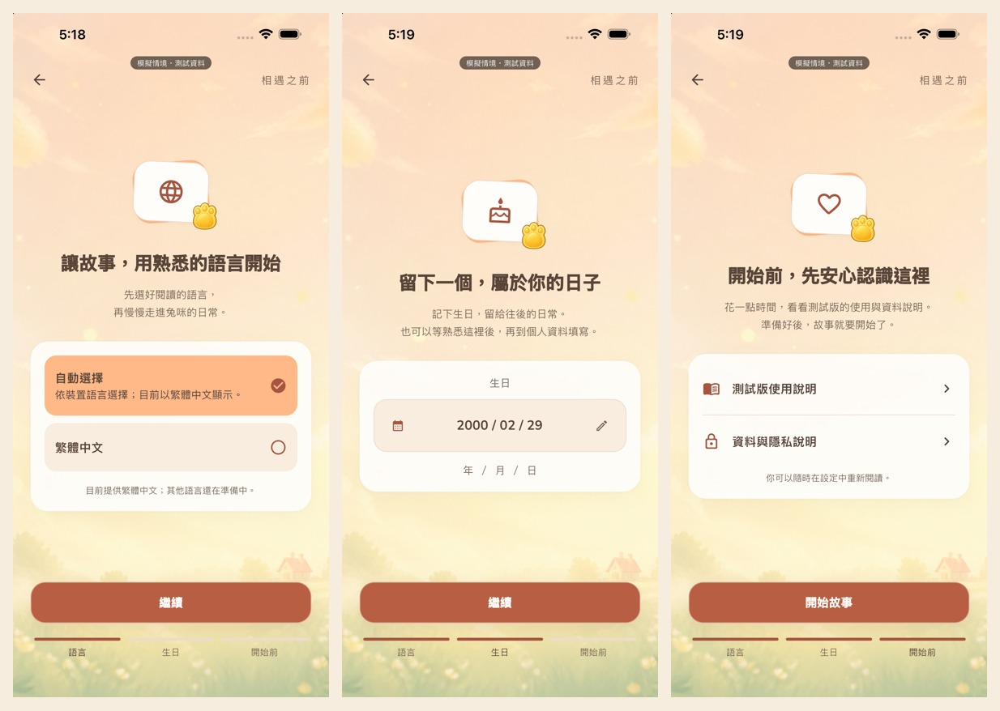

# 初次相遇前的設定

更新：2026-09-18。來源為 `/Users/raraku/habit-app-redesign`／`codex/beta`。

## 本輪範圍與故事方向

使用者指定旅程：封面／選擇訪客或首次帳號登入 → 語言 → 生日 → 必要使用／隱私資訊 →
開始故事 → 按門鈴 → 第一次遇見兔咪 → 兔咪問玩家稱呼 → 玩家替兔咪取暱稱 →
小型生活事件 → 正式進入家。

本輪實作前半段的語言、生日及開始前說明。後半段按門鈴、稱呼順序、小事件仍待接續製作；
目前按「開始故事」接既有兩幕短初見，不能宣稱完整新劇本已整合。
原六幕回憶與其他故事不修改。

原生三步驟合圖；來源為本輪最後版 iPhone 14 Pro Max 模擬器截圖，僅縮小並排供檢視。

## 畫面與儲存

- 新旅程共用 `/onboarding` 路由：訪客及確認沒有備份的 Google／Apple 新帳號都先到準備頁。
  已完成初見的存檔仍直接進家；既有存檔還原與家庭 PIN 閘門沿用原流程。
- 語言沿用 `AppLocaleSettings`：目前提供跟隨系統／繁體中文，系統不支援的語言回退繁中。
  沒有因為存在英文 ARB 就把未完成的語言開放。
- 生日沿用 `showBirthdayPicker`：八碼快速輸入、年／月直選、相同日期範圍；生日可稍後填。
  使用既有 `userBirthday`，日期格式 `yyyy-MM-dd`；不填不創造預設生日。
- 暖天空背景、紙卡、腳印小章；進場採有限時長淡入／輕移，步驟交替淡入。
  降低動態省略位移及轉場時間；不加持續粒子、不提前顯示兔咪角色。
- SafeArea → 最大 520pt 寬 → 固定操作列與可捲動內容。430pt 時紙卡外寬 382pt；
  320pt 時 272pt。鍵盤由既有生日 dialog 處理；不縮放整個畫面掩蓋不足的空間。
- 每一步保存成功才前進，失敗原地重試；設定進度與初見完成分開，不提前設定 `onboardingDone`
  或頒發報到獎勵。重啟可接續設定；完成準備但未完成故事時，仍可回到初見。
- 本機準備進度不加入雲端匯出白名單，既有生日仍依原備份範圍匯出。
- 最後一步不設必勾框；僅保存準備進度版本與時間，不記為資料蒐集同意。說明可從設定重新閱讀。

## 資料政策尚未定案

使用者希望先理解 Apple 對個人開發者的要求並討論資料用途，尚未核准正式服務條款、
隱私政策、分析資料收集方式。使用者希望全年齡可用，並希望取得大致年齡層與地區統計；
首發市場已確認為台灣，上傳設計與兒童同意仍待定案。畫面中的「測試版使用說明／資料與隱私說明」
是現有功能說明，不是公開版正式政策，也不授權新增資料上傳。

查證與待決策範圍見 [Apple 隱私與資料規劃](apple_privacy_data_plan.md)。

## 驗證

- 新增 widget 測試涵蓋訪客／Google／Apple 模擬登入、回訪、閏日輸入、保存失敗重試、
  中斷接續，以及 320×568／430×932pt、中英文實際文案、1.3 倍字級及降低動態。
- 原生驗證沿用 `integration_test/entry_integration_review_test.dart`，從真 App root 走訪客、
  語言、生日 picker／鍵盤、資料說明、既有初見、首頁與計時器。偏好／帳號為測試隔離狀態。
- 最終 `flutter analyze` 無問題；新增的 11 項準備頁測試及完整 1,262 項 Flutter 測試通過。
  首次完整測試與原生建置重疊時曾有一項 shader 載入失敗；未修改場景程式，分開重跑該檔 3 項
  與完整測試均通過。尚未證實原失敗原因，不將其描述為已修復場景缺陷。
- 最後版原生整合測試通過，產出 16 張截圖；環境為 iPhone 14 Pro Max／iOS 26.5 模擬器，
  430×932pt、上下 safe area 59／34pt、繁中、字級 1.0，涵蓋原生數字鍵盤與 2000-02-29 閏日。
  build flavor 為 `redesign`，bundle ID 為 `com.yayoi991331.habitapp.redesign`。
- 原生 review 指令為 `python3 scripts/review/run_entry_integration.py --device A1321A98-4FE6-4DD6-82E8-E5920F9F275F --output /private/tmp/tumi-preparation-final-20260918`。
  本機完整產物位於 `design_trials/onboarding_preparation_20260918/`，索引為 `capture.json`；
  80.13 秒流程錄影另成功解碼檢視 8 個取樣畫面，結果見 `media_review.json`，並非逐幀效能驗證。
- 模擬器不代表本人實機美感、音訊、觸感及 release 效能核可；真實 Google／Apple 登入與後台資料流程未在本輪驗收。

最重要的下一步：依已確認的台灣、全年齡及功能／故事／年齡層／地區需求，定義資料欄位、未成年流程與正式政策，並接續後半段初見腳本。
